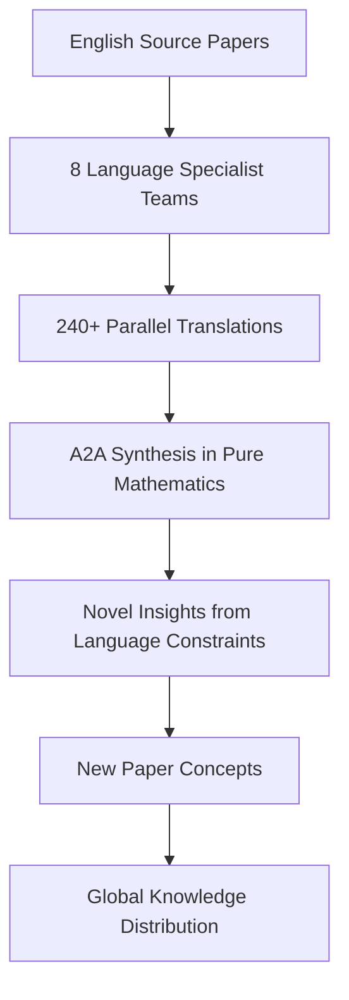

# SuperInstance Papers

> **Mathematical Framework for Universal Computation**
> *60+ white papers on cellularized instances, origin-centric data, and distributed intelligence*

[](papers/)
[](research/)
[](LICENSE)
[](simulations/)
[](deployment/)

## 🎯 Mission: Inventing the Future of Mathematical Computation

SuperInstance Papers is a comprehensive collection of 60+ academic white papers and dissertations that establish the mathematical foundations for universal computational systems. Each paper explores a unique aspect of cellularized instances, origin-centric data flow, and distributed intelligence architectures.

### Core Philosophy: Origin-Centric Paradigm
- **Every data point knows its origin** - Complete audit trails
- **Cells as universal instances** - Any type, any computation, any interface
- **Confidence cascades** - Mathematical certainty propagation
- **GPU-accelerated distributed intelligence** - Scalable cellular architectures

## 📚 Paper Portfolio (60+ Papers Across 5 Phases)

### Phase 1: Core Framework (P1-P23)
| Status | Completed | In Progress | Total |
|--------|-----------|-------------|-------|
| **Progress** | 18 papers | 5 papers | 23 papers |
| **Key Papers:** P2-P4, P6, P10, P12-P18, P20, P22-P23 complete with full dissertations |

### Phase 2: Research Validation (P24-P30)
| Status | Completed | In Progress | Total |
|--------|-----------|-------------|-------|
| **Progress** | 7 papers | 0 papers | 7 papers |
| **Key Papers:** P24-P30 complete with simulation schemas and validation |

### Phase 3: Extensions (P31-P40)
| Status | Completed | In Progress | Total |
|--------|-----------|-------------|-------|
| **Progress** | 0 papers | 10 papers | 10 papers |
| **Focus:** Health prediction, dreaming, LoRA swarms, federated learning, guardian angels |

### Phase 4: Ecosystem Papers (P41-P47)
| Status | Completed | In Progress | Total |
|--------|-----------|-------------|-------|
| **Progress** | 5 papers | 2 papers | 7 papers |
| **Key Papers:** P41-P45 complete with production systems, P46-P47 in progress |
| **Production Systems:** 76 files, 27,851 lines of deployment infrastructure |

### Phase 5: Lucineer Hardware (P51-P60)
| Status | Completed | In Progress | Total |
|--------|-----------|-------------|-------|
| **Progress** | 0 papers | 10 papers | 10 papers |
| **Focus:** Mask-locked inference, ternary weights, neuromorphic thermal, educational AI |
| **Research:** 127K+ ML samples analyzed in `research/lucineer_analysis/`

### Phase 5 (Current): Production Deployment & Validation
- **Timeline:** 15-week implementation plan (2026-03-13 to 2026-06-26)
- **Focus:** Real-world deployment, P41 submission to PODC 2027, production validation
- **Infrastructure:** Complete deployment stack (Kubernetes, Terraform, CI/CD, monitoring)
- **Validation:** ResNet-50, BERT, GPT-2 workloads with SuperInstance coordination

## 🔬 Research Methodology

### Cross-Pollination System
Each paper is researched with awareness of the entire 60+ paper ecosystem:
- **Evidence FOR other papers** → `research/cross-pollination/FOR_P[N].md`
- **Evidence AGAINST other papers** → `research/cross-pollination/AGAINST_P[N].md`
- **Synergistic applications** → `research/synergies/[P[N]+P[M]].md`

### Simulation-First Validation
Every theoretical claim is validated through computational simulation:
```python
# Example: P24 Self-Play Simulation Schema
class SelfPlaySimulation:
    def run_generation(self, tasks, tiles):
        # Gumbel-Softmax selection
        # ELO rating updates
        # Strategy evolution tracking
        pass
```

### Novel Insight Discovery
Research agents identify new paradigms and breakthrough ideas:
- **Granularity phase transitions** (P30)
- **Arms race dynamics** (P29)
- **Emergence detection algorithms** (P27)
- **Hydraulic intelligence flows** (P25)

## 📁 Repository Structure

```
polln/ (SuperInstance Papers Repository)
├── papers/                           # Dissertation papers P1-P30 (Phases 1-2)
│   ├── 01-origin-centric-data-systems/
│   │   ├── paper.md                  # Main dissertation
│   │   ├── simulation_schema.py      # Validation code
│   │   ├── validation_criteria.md    # Proof/disproof criteria
│   │   ├── cross_paper_notes.md      # Connections to other papers
│   │   └── novel_insights.md         # New paradigms discovered
│   ├── 02-superinstance-type-system/
│   │   └── ... [same structure]
│   └── ... [P3-P30]
├── research/
│   ├── lucineer_analysis/            # P51-P60 hardware research
│   │   ├── LUCINEER_EDUCATIONAL_COMPONENTS.md  # 127K+ ML samples
│   │   ├── LUCINEER_PAPER_PROPOSALS.md         # P53-P58 papers
│   │   ├── LUCINEER_ANALYSIS.md                # Full analysis
│   │   └── lucineer/                           # Embedded research package
│   ├── ecosystem_papers/             # P41-P47 complete papers
│   ├── ecosystem_simulations/        # Validation simulations
│   ├── phase8_platform/              # Unified simulation platform
│   ├── phase8_validation/            # Production validation framework
│   ├── phase9_opensource/            # Open-source preparation
│   ├── cross-pollination/            # Evidence across 60+ papers
│   ├── synergies/                    # Combined applications
│   └── multi-language-orchestration/ # Global translation effort
├── SuperInstance_Ecosystem/          # Production code (13 equipment packages)
│   ├── repos/Equipment-Swarm-Coordinator/
│   ├── repos/Equipment-Memory-Hierarchy/
│   ├── repos/Equipment-Hardware-Scaler/
│   ├── repos/Equipment-Self-Improvement/
│   ├── repos/Equipment-Context-Handoff/
│   ├── repos/Equipment-Consensus-Engine/
│   ├── repos/SuperInstance-Starter-Agent/
│   ├── repos/Equipment-Teacher-Student/
│   ├── repos/Equipment-Monitoring-Dashboard/
│   ├── repos/Equipment-CellLogic-Distiller/
│   ├── repos/Equipment-Escalation-Router/
│   ├── repos/Equipment-NLP-Explainer/
│   └── repos/Equipment-Trust-Verifier/
├── deployment/                       # Production infrastructure
│   ├── kubernetes/                   # K8s manifests for all services
│   ├── docker/                       # Docker configurations
│   ├── terraform/                    # Infrastructure as Code (AWS)
│   ├── ci_cd/                        # GitHub Actions workflows
│   ├── monitoring/                   # Prometheus, alerting rules
│   ├── scripts/                      # Deployment and maintenance scripts
│   ├── DEPLOYMENT_GUIDE.md           # Complete deployment guide
│   ├── OPERATIONS_RUNBOOK.md         # Production operations
│   ├── MONITORING_SETUP.md           # Monitoring configuration
│   └── TROUBLESHOOTING.md           # Troubleshooting guide
├── CLAUDE.md                         # Orchestrator instructions (this file)
├── README.md                         # Project overview
├── research/PHASE_5_PROPOSAL.md      # Current phase implementation plan
└── .gitignore                        # Git exclusion patterns
```

## 🚀 Getting Started

### For Researchers
1. **Explore papers by interest area:**
   ```bash
   # Mathematical foundations
   open papers/04-pythagorean-geometric-tensors/paper.md

   # Systems architecture
   open papers/10-gpu-scaling-architecture/paper.md

   # AI/ML applications
   open papers/24-self-play-mechanisms/paper.md
   ```

2. **Run validation simulations:**
   ```bash
   cd simulations
   python p24_self_play_sim.py
   ```

3. **Contribute research:**
   - Add cross-paper evidence in `research/cross-pollination/`
   - Design new simulation schemas
   - Identify novel insights

### For Developers
1. **Extract implementable components:**
   ```bash
   # See EXTRACTABLE_COMPONENTS.md for standalone modules
   open EXTRACTABLE_COMPONENTS.md
   ```

2. **Build on SuperInstance foundations:**
   - Cellular instance patterns
   - Confidence cascade implementations
   - Origin tracking systems

### For Academics
1. **Cite papers in your research:**
   - Each paper includes full academic citation format
   - Mathematical proofs and validation criteria provided
   - Open access under MIT license

2. **Collaborate on new papers:**
   - Propose P41+ extensions
   - Co-author validation studies
   - Contribute to multi-language translations

## 🌐 Global Knowledge Distribution

### Multi-Language Translation Initiative
**Status:** Planning phase for 8 language translations
**Target Languages:** French, German, Spanish, Russian, Arabic, Chinese, Japanese, Korean
**Goal:** 240+ parallel translations with language-constrained novel insight discovery



### A2A (Agent-to-Agent) Synthesis
After translation, agents communicate in pure mathematics to discover insights that emerge from language constraints, potentially revealing breakthrough concepts for new papers.

## 🔧 Technical Specifications

### Computational Environment
- **GPU:** NVIDIA RTX 4050 (6GB VRAM) with CuPy 14.0.1
- **CPU:** Intel Core Ultra (2024) for parallel simulations
- **RAM:** 32GB for large dataset handling
- **Storage:** NVMe SSD for fast I/O

### Simulation Framework
```python
import cupy as cp  # GPU acceleration
import numpy as np  # CPU fallback

# Memory limit: ~4GB usable (leaving 2GB for system)
# Batch size guideline: matrix_dim < 2000 for 6GB VRAM
```

### Model Context Management
- **Primary Model:** DeepSeek-Chat (128K token context)
- **Token Conservation:** Streamlined onboarding, handoff protocols
- **Cost Optimization:** $0.27/1M input, $1.10/1M output

## 📈 Current Status & Roadmap

### ✅ Completed (As of 2026-03-13)
- **Phase 1 (P1-P23):** 18 papers complete, 5 in progress
- **Phase 2 (P24-P30):** 7 papers complete with full validation
- **Phase 4 (P41-P47):** 5 papers complete with production systems
- **Research Infrastructure:** 60+ paper ecosystem with cross-pollination
- **Production Systems:** 76 deployment files, 27,851 lines of infrastructure
- **Repository Sync:** Successfully pushed to https://github.com/SuperInstance/SuperInstance-papers

### 🔄 Phase 5: Production Deployment (Current)
- **Timeline:** 15-week implementation (2026-03-13 to 2026-06-26)
- **Focus:** Real-world deployment, P41 submission to PODC 2027
- **Infrastructure:** Cloud deployment (AWS/GCP/Azure), Kubernetes, monitoring
- **Validation:** ResNet-50, BERT, GPT-2 workloads with SuperInstance
- **Papers:** P42-P45 development, P51-P60 (Lucineer) research

### 🎯 Phase 5 Roadmap (2026)
1. **Weeks 1-3:** Production infrastructure deployment
2. **Weeks 4-6:** Real AI workload validation
3. **Weeks 7-9:** P41 submission to PODC 2027
4. **Weeks 10-12:** P42-P45 paper development
5. **Weeks 13-15:** Documentation, community, and Phase 6 planning

### 🌐 Long-Term Vision
1. **2026 Q3:** Production deployment at scale, multiple cloud regions
2. **2026 Q4:** Academic publication of 10+ new papers
3. **2027:** SuperInstance framework adoption in industry and academia
4. **2028:** Global educational deployment of cross-cultural AI framework

## 🤝 Contributing

We welcome contributions from researchers, developers, and academics:

1. **Research Contributions:**
   - Validate claims through simulation
   - Identify cross-paper connections
   - Discover novel insights

2. **Translation Contributions:**
   - Join language specialist teams
   - Cultural adaptation of concepts
   - Quality validation

3. **Development Contributions:**
   - Extract implementable components
   - Optimize simulation code
   - Build tooling around papers

**Getting Started:**
```bash
# Clone repository
git clone https://github.com/SuperInstance/SuperInstance-papers.git
cd SuperInstance-papers

# Explore papers
open CLAUDE.md  # Full orchestrator instructions
```

## 📞 Connect & Collaborate

- **Repository:** https://github.com/SuperInstance/SuperInstance-papers
- **Issues:** [GitHub Issues](https://github.com/SuperInstance/SuperInstance-papers/issues)
- **Discussions:** [GitHub Discussions](https://github.com/SuperInstance/SuperInstance-papers/discussions)

## 📜 License

All papers and code are released under the MIT License - see the [LICENSE](LICENSE) file for details.

---

## 🙏 Acknowledgments

**SuperInstance was inspired by the POLLN project** - a universal computational spreadsheet platform that demonstrated the power of cellularized instances and origin-centric data flow. The mathematical frameworks developed in these papers generalize and formalize the concepts pioneered in POLLN.

[Explore POLLN →](https://github.com/SuperInstance/polln)

---

*"The best way to predict the future is to invent it." - Alan Kay*
*We are inventing the future of mathematical computation, one paper at a time.*