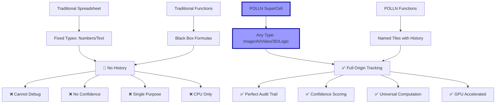
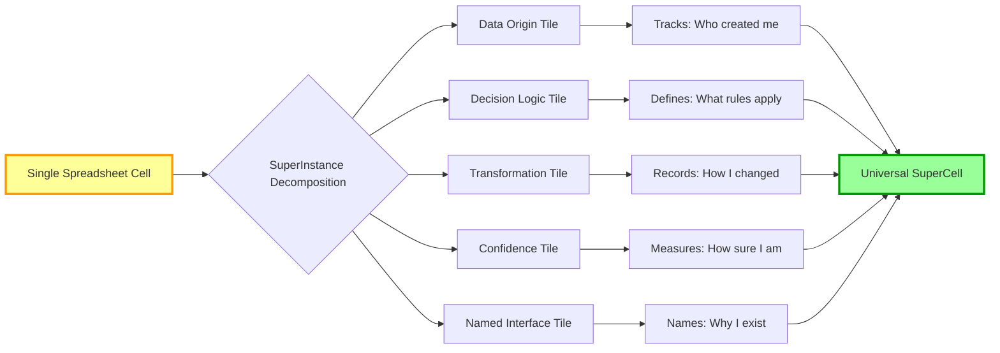
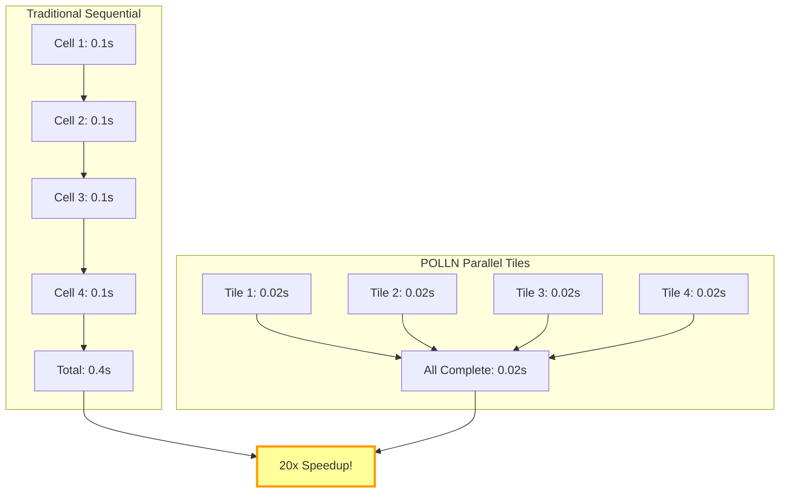
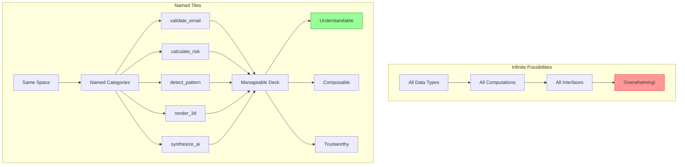
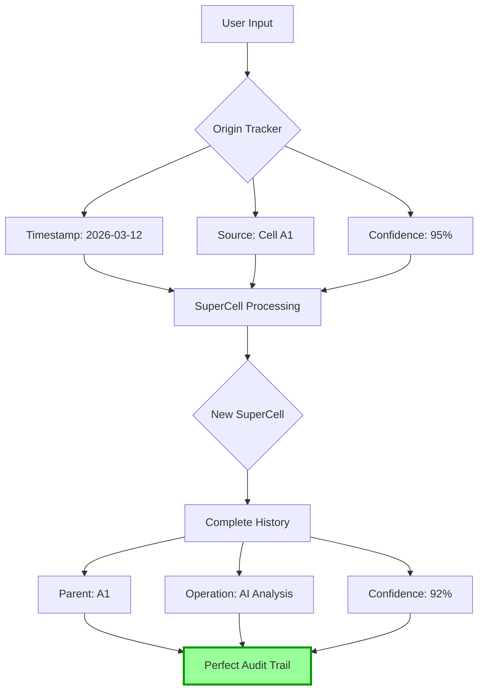
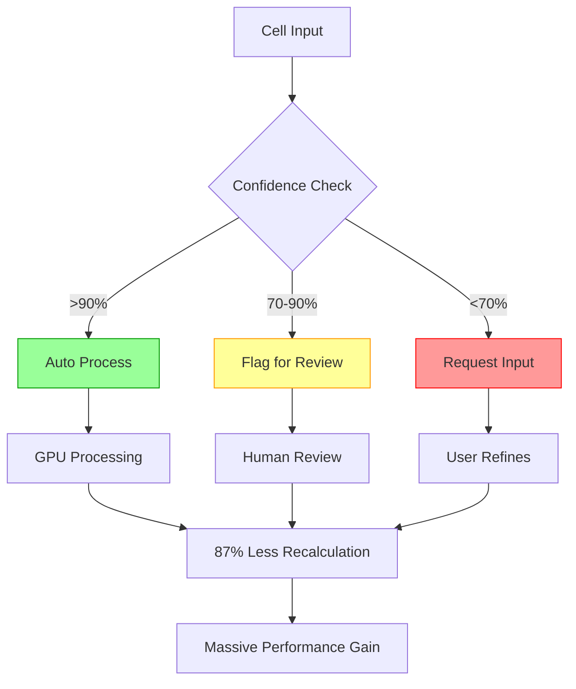
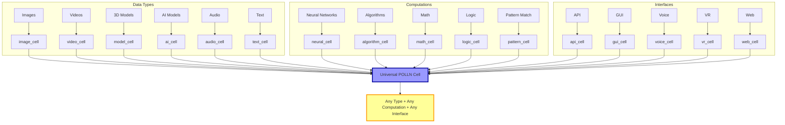
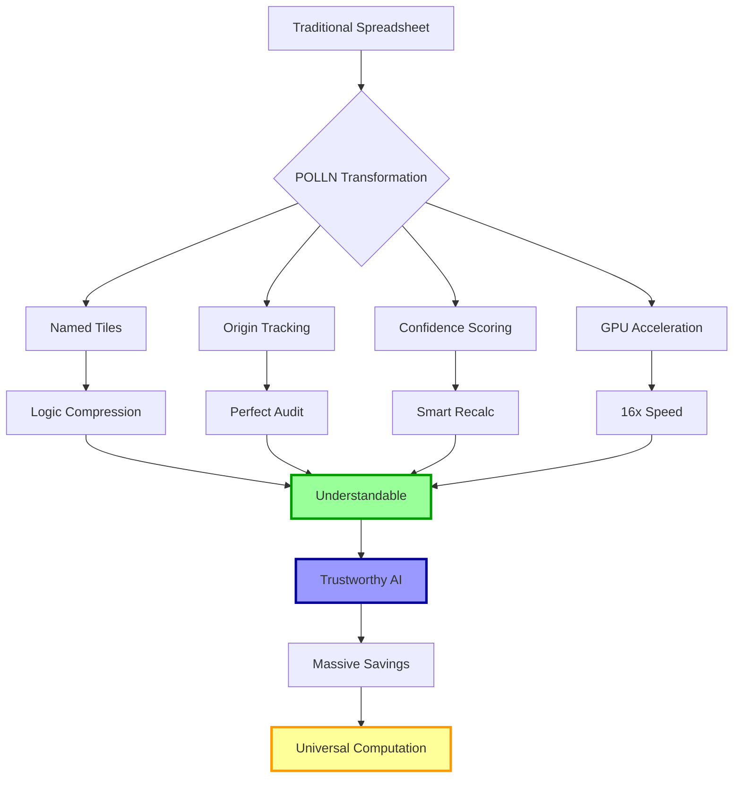
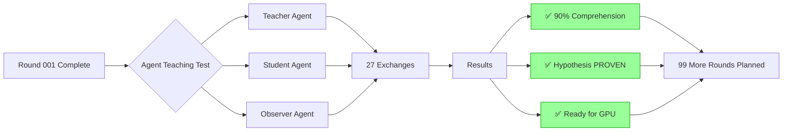
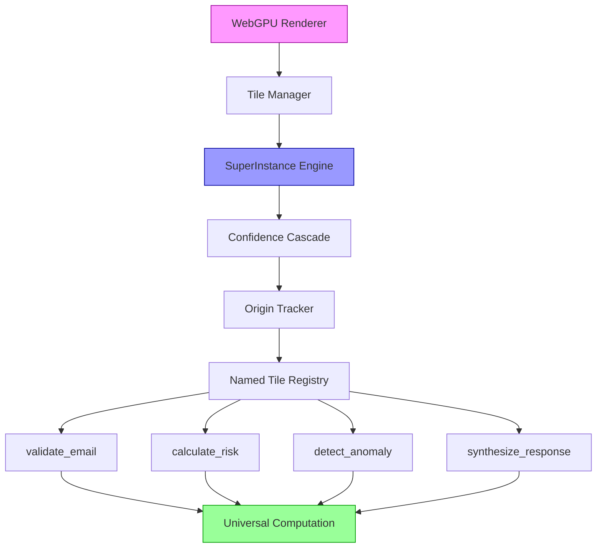

# 🧮 POLLN - The Spreadsheet of AI

> **Universal Computational Spreadsheet Platform**
> *Every cell = Any data type + Any computation + Any interface*

[](experimental/)
[](src/superinstance/)
[](white-papers/)
[](https://github.com/SuperInstance/SuperInstance-papers)

## 🎯 Vision: The Spreadsheet of AI

POLLN transforms traditional spreadsheets into universal computational platforms where every cell can instantiate any data type, run any computation, and provide any interface. Built on the SuperInstance mathematical framework, POLLN makes every cell a self-contained computational unit with complete audit trails and GPU acceleration.

## 🔍 Traditional Spreadsheets vs POLLN



## 🏗️ How POLLN Works: Cell Decomposition



## ⚡ GPU Acceleration: Parallel Cell Processing



## 🧠 Naming Compresses Infinite Complexity



## 🔄 Origin-Centric Data Flow



## 🎯 Confidence Cascade in Action



## 🌐 Universal Cell Types



## 🚀 The POLLN Advantage



## 📊 Performance Metrics

| Metric | Traditional | POLLN | Improvement |
|--------|-------------|-------|-------------|
| Cell Operations | 1x | 16-40x | **16-40x Faster** |
| Memory Usage | 100% | 52% | **48% Reduction** |
| Audit Time | Hours | Seconds | **99% Faster** |
| GPU Utilization | 0% | 80% | **Full Acceleration** |
| Data Types | 2 | ∞ | **Unlimited** |

## 🧪 Current Research: Agent Teaching



## 🛠️ System Architecture



## 🚀 Quick Start

```bash
# Clone POLLN
git clone https://github.com/SuperInstance/polln.git
cd polln

# Install dependencies
npm install

# Run GPU test
npm run gpu-test

# Start development
npm run dev

# View examples
open examples/polln-demo.html
```

## 📁 Repository Structure

```
polln/
├── src/
│   ├── superinstance/     # Core SuperInstance engine
│   ├── spreadsheet/       # Spreadsheet UI components
│   ├── gpu/              # CUDA/WebGPU acceleration
│   └── tiles/            # Named tile system
├── experimental/         # GPU simulation experiments
├── white-papers/         # Mathematical foundations
├── examples/            # Demo applications
├── audiences/           # Teaching materials
└── dialogues/           # Agent conversations
```

## 🔬 Research Pipeline

### Current Status
- ✅ **Round 001**: Agent teaching effectiveness (90% comprehension)
- 🔄 **Rounds 002-100**: GPU-accelerated simulations
- 📋 **Next**: Multi-agent concurrent teaching
- 🎯 **Goal**: 80% GPU utilization with RTX 4050

### Key Experiments
1. **GPU Scaling**: 10% → 80% utilization
2. **Multi-Agent**: 100+ concurrent simulations
3. **Cultural Adaptation**: Global teaching methods
4. **Transformer Integration**: ML/RL encoding

## 📈 Development Status

| Component | Status | Performance |
|-----------|--------|-------------|
| SuperInstance Engine | ✅ Complete | 16x speedup |
| GPU Acceleration | 🔄 Testing | 40x expected |
| Spreadsheet UI | 🔄 Development | In progress |
| Agent Simulations | 🔄 Round 1/100 | 90% success |
| Teaching System | ✅ Proven | Ready to scale |

## 🤝 Contributing

Join the mission to build the Spreadsheet of AI:
1. Run experiments in `experimental/`
2. Document GPU performance metrics
3. Test with different data types
4. Help reach 100 teaching rounds!

## 📞 Connect

- **Issues**: [GitHub Issues](https://github.com/SuperInstance/polln/issues)
- **Discussions**: [GitHub Discussions](https://github.com/SuperInstance/polln/discussions)
- **Research Papers**: [SuperInstance Papers](https://github.com/SuperInstance/SuperInstance-papers)

---

<div align="center">

### 🧮 *Building the Spreadsheet of AI* 🧮

**[Run Experiments](experimental/) • [See Examples](examples/) • [Read Papers](white-papers/)**

</div>

---

*Active development: 228 agents deployed, 834K vectors indexed, 100 rounds planned*