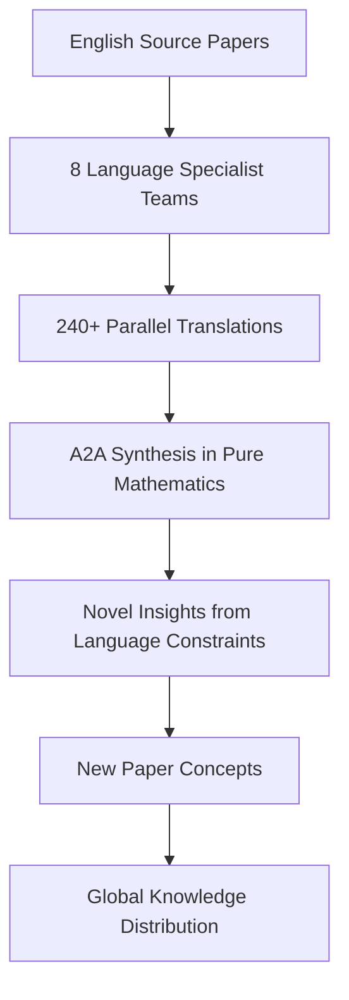

# SuperInstance Papers

> **Mathematical Framework for Universal Computation**
> *40+ white papers on cellularized instances, origin-centric data, and distributed intelligence*

[](papers/)
[](research/)
[](LICENSE)
[](simulations/)

## 🎯 Mission: Inventing the Future of Mathematical Computation

SuperInstance Papers is a comprehensive collection of 40+ academic white papers and dissertations that establish the mathematical foundations for universal computational systems. Each paper explores a unique aspect of cellularized instances, origin-centric data flow, and distributed intelligence architectures.

### Core Philosophy: Origin-Centric Paradigm
- **Every data point knows its origin** - Complete audit trails
- **Cells as universal instances** - Any type, any computation, any interface
- **Confidence cascades** - Mathematical certainty propagation
- **GPU-accelerated distributed intelligence** - Scalable cellular architectures

## 📚 Paper Portfolio

### Phase 1: Core Framework (P1-P23)
| Paper | Title | Status | Focus |
|-------|-------|--------|-------|
| P1 | Origin-Centric Data Systems | 🔄 In Progress | Foundational data model |
| P2 | SuperInstance Type System | ✅ Complete | Universal type theory |
| P3 | Confidence Cascade Architecture | ✅ Complete | Certainty propagation |
| P4 | Pythagorean Geometric Tensors | ✅ Complete | Mathematical foundations |
| P5 | Rate-Based Change Mechanics | 🔄 In Progress | Dynamic systems |
| P6 | Laminar vs Turbulent Systems | ✅ Complete | Flow classification |
| P7 | SMPbot Architecture | 🔄 In Progress | Cellular instance design |
| P8 | Tile Algebra Formalization | 🔄 In Progress | Algebraic structures |
| P9 | Wigner-D Harmonics SO(3) | 🔄 In Progress | Group theory applications |
| P10 | GPU Scaling Architecture | ✅ Complete | Parallel computation |
| P11 | Thermal Simulation | 🔄 In Progress | Thermodynamic computing |
| P12 | Distributed Consensus | ✅ Complete | Agreement protocols |
| P13 | Agent Network Topology | ✅ Complete | Connection patterns |
| P14 | Multi-Modal Fusion | ✅ Complete | Sensor integration |
| P15 | Neuromorphic Circuits | ✅ Complete | Brain-inspired computing |
| P16 | Game Theory | ✅ Complete | Strategic interaction |
| P17 | Adversarial Robustness | ✅ Complete | Security foundations |
| P18 | Energy Harvesting | ✅ Complete | Sustainable computing |
| P19 | Causal Traceability | 🔄 In Progress | Causality tracking |
| P20 | Structural Memory | ✅ Complete | Persistent storage |
| P21 | Stochastic Superiority | 🔄 In Progress | Probabilistic advantage |
| P22 | Edge-to-Cloud Evolution | ✅ Complete | Distributed deployment |
| P23 | Bytecode Compilation | ✅ Complete | Execution optimization |

### Phase 2: Next Generation Research (P24-P40)
| Tier | Papers | Status | Focus |
|------|--------|--------|-------|
| HIGH | P24-P27 | ✅ Complete | Self-play, hydraulic intelligence, value networks, emergence detection |
| MEDIUM | P28-P30 | ✅ Complete | Stigmergic coordination, competitive coevolution, granularity analysis |
| EXTENSIONS | P31-P40 | ⏳ Queued | Health prediction, dreaming, LoRA swarms, federated learning, guardian angels, time-travel debug, energy-aware computing, ZK proofs, holographic memory, quantum superposition |

## 🔬 Research Methodology

### Cross-Pollination System
Each paper is researched with awareness of the entire 40+ paper ecosystem:
- **Evidence FOR other papers** → `research/cross-pollination/FOR_P[N].md`
- **Evidence AGAINST other papers** → `research/cross-pollination/AGAINST_P[N].md`
- **Synergistic applications** → `research/synergies/[P[N]+P[M]].md`

### Simulation-First Validation
Every theoretical claim is validated through computational simulation:
```python
# Example: P24 Self-Play Simulation Schema
class SelfPlaySimulation:
    def run_generation(self, tasks, tiles):
        # Gumbel-Softmax selection
        # ELO rating updates
        # Strategy evolution tracking
        pass
```

### Novel Insight Discovery
Research agents identify new paradigms and breakthrough ideas:
- **Granularity phase transitions** (P30)
- **Arms race dynamics** (P29)
- **Emergence detection algorithms** (P27)
- **Hydraulic intelligence flows** (P25)

## 📁 Repository Structure

```
SuperInstance-papers/
├── papers/                           # Dissertation papers P1-P40
│   ├── 01-origin-centric-data-systems/
│   │   ├── paper.md                  # Main dissertation
│   │   ├── simulation_schema.py      # Validation code
│   │   ├── validation_criteria.md    # Proof/disproof criteria
│   │   ├── cross_paper_notes.md      # Connections to other papers
│   │   └── novel_insights.md         # New paradigms discovered
│   ├── 02-superinstance-type-system/
│   │   └── ... [same structure]
│   └── ... [P3-P40]
├── white-papers/                     # White papers (36+)
│   ├── 01-SuperInstance-Universal-Cell.md
│   ├── 02-Confidence-Cascade-Architecture.md
│   └── ... [34 more]
├── research/
│   ├── cross-pollination/            # Evidence across papers
│   │   ├── FOR_P21.md                # Evidence FOR P21
│   │   ├── AGAINST_P27.md            # Evidence AGAINST P27
│   │   └── ... [cross-paper evidence]
│   ├── synergies/                    # Combined applications
│   │   └── [P24+P29].md              # Self-play + Coevolution
│   ├── simulations/                  # Simulation code
│   │   └── [paper]_sim.py
│   └── multi-language-orchestration/ # Global translation effort
│       ├── MULTI_LANGUAGE_ORCHESTRATION_MASTER_PLAN.md
│       └── ... [onboarding docs]
├── tools/
│   └── innovation-concepts/          # Tool implementations
├── simulations/                      # Run simulations
├── CLAUDE.md                         # Orchestrator instructions
└── README.md                         # This file
```

## 🚀 Getting Started

### For Researchers
1. **Explore papers by interest area:**
   ```bash
   # Mathematical foundations
   open papers/04-pythagorean-geometric-tensors/paper.md

   # Systems architecture
   open papers/10-gpu-scaling-architecture/paper.md

   # AI/ML applications
   open papers/24-self-play-mechanisms/paper.md
   ```

2. **Run validation simulations:**
   ```bash
   cd simulations
   python p24_self_play_sim.py
   ```

3. **Contribute research:**
   - Add cross-paper evidence in `research/cross-pollination/`
   - Design new simulation schemas
   - Identify novel insights

### For Developers
1. **Extract implementable components:**
   ```bash
   # See EXTRACTABLE_COMPONENTS.md for standalone modules
   open EXTRACTABLE_COMPONENTS.md
   ```

2. **Build on SuperInstance foundations:**
   - Cellular instance patterns
   - Confidence cascade implementations
   - Origin tracking systems

### For Academics
1. **Cite papers in your research:**
   - Each paper includes full academic citation format
   - Mathematical proofs and validation criteria provided
   - Open access under MIT license

2. **Collaborate on new papers:**
   - Propose P41+ extensions
   - Co-author validation studies
   - Contribute to multi-language translations

## 🌐 Global Knowledge Distribution

### Multi-Language Translation Initiative
**Status:** Planning phase for 8 language translations
**Target Languages:** French, German, Spanish, Russian, Arabic, Chinese, Japanese, Korean
**Goal:** 240+ parallel translations with language-constrained novel insight discovery



### A2A (Agent-to-Agent) Synthesis
After translation, agents communicate in pure mathematics to discover insights that emerge from language constraints, potentially revealing breakthrough concepts for new papers.

## 🔧 Technical Specifications

### Computational Environment
- **GPU:** NVIDIA RTX 4050 (6GB VRAM) with CuPy 14.0.1
- **CPU:** Intel Core Ultra (2024) for parallel simulations
- **RAM:** 32GB for large dataset handling
- **Storage:** NVMe SSD for fast I/O

### Simulation Framework
```python
import cupy as cp  # GPU acceleration
import numpy as np  # CPU fallback

# Memory limit: ~4GB usable (leaving 2GB for system)
# Batch size guideline: matrix_dim < 2000 for 6GB VRAM
```

### Model Context Management
- **Primary Model:** DeepSeek-Chat (128K token context)
- **Token Conservation:** Streamlined onboarding, handoff protocols
- **Cost Optimization:** $0.27/1M input, $1.10/1M output

## 📈 Current Status & Roadmap

### ✅ Completed
- **Phase 1:** 18/23 papers complete with full dissertations
- **Phase 2 (P24-P30):** 7/17 papers with complete simulation schemas
- **Research Infrastructure:** Cross-pollination system, validation frameworks

### 🔄 In Progress
- **Phase 1 Completion:** 5 papers in finalization
- **Phase 2 Extension:** P31-P40 schema development
- **Multi-Language Translation:** Onboarding document creation

### 🎯 Future Roadmap
1. **Q2 2026:** Complete all 40 papers with simulations
2. **Q3 2026:** 8-language translation completion
3. **Q4 2026:** Global academic publication
4. **2027:** SuperInstance framework reference implementation

## 🤝 Contributing

We welcome contributions from researchers, developers, and academics:

1. **Research Contributions:**
   - Validate claims through simulation
   - Identify cross-paper connections
   - Discover novel insights

2. **Translation Contributions:**
   - Join language specialist teams
   - Cultural adaptation of concepts
   - Quality validation

3. **Development Contributions:**
   - Extract implementable components
   - Optimize simulation code
   - Build tooling around papers

**Getting Started:**
```bash
# Clone repository
git clone https://github.com/SuperInstance/SuperInstance-papers.git
cd SuperInstance-papers

# Explore papers
open CLAUDE.md  # Full orchestrator instructions
```

## 📞 Connect & Collaborate

- **Repository:** https://github.com/SuperInstance/SuperInstance-papers
- **Issues:** [GitHub Issues](https://github.com/SuperInstance/SuperInstance-papers/issues)
- **Discussions:** [GitHub Discussions](https://github.com/SuperInstance/SuperInstance-papers/discussions)
- **Main Project:** [POLLN - The Spreadsheet of AI](https://github.com/SuperInstance/polln)

## 📜 License

All papers and code are released under the MIT License - see the [LICENSE](LICENSE) file for details.

---

## 🙏 Acknowledgments

**SuperInstance was inspired by the POLLN project** - a universal computational spreadsheet platform that demonstrated the power of cellularized instances and origin-centric data flow. The mathematical frameworks developed in these papers generalize and formalize the concepts pioneered in POLLN.

[Explore POLLN →](https://github.com/SuperInstance/polln)

---

*"The best way to predict the future is to invent it." - Alan Kay*
*We are inventing the future of mathematical computation, one paper at a time.*