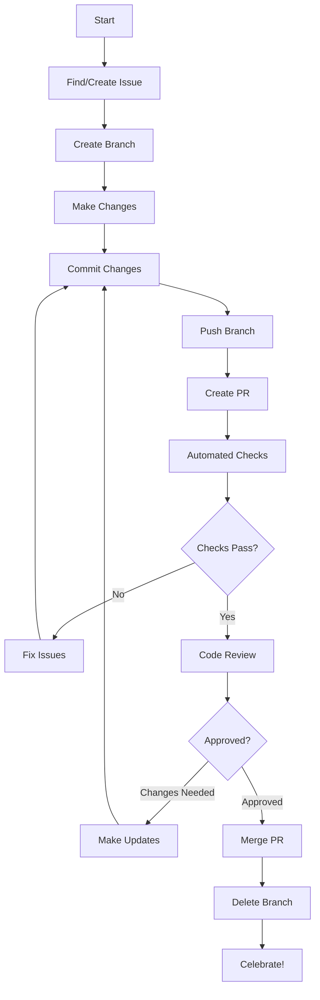

# Pull Request Workflow

This guide explains the complete pull request (PR) workflow for Spreadsheet Moment, from creation to merge.

## Overview

A pull request is how you propose changes to the codebase. This document covers the entire PR lifecycle to ensure smooth collaboration and code quality.



## Before Creating a PR

### 1. Ensure Your Branch is Up-to-Date

```bash
# Fetch latest changes from upstream
git fetch upstream

# Rebase your branch on latest main
git rebase upstream/main

# Or merge latest main into your branch
git merge upstream/main

# Push updated branch
git push origin your-branch-name --force-with-lease
```

### 2. Run All Tests

```bash
# Run full test suite
npm test

# Run with coverage
npm run test:coverage

# Run specific tests
npm test -- --grep "describe pattern"

# Ensure all tests pass before proceeding!
```

### 3. Check Code Quality

```bash
# Run linter
npm run lint

# Fix auto-fixable issues
npm run lint -- --fix

# Format code
npm run format

# Run type checking
npm run type-check
```

### 4. Review Your Changes

```bash
# Show changes
git diff

# Show commit history
git log

# Show changes since last commit
git diff HEAD~1
```

## Creating a Pull Request

### Step 1: Push Your Branch

```bash
# Push your branch to your fork
git push origin feature/your-feature-name

# For first push to new branch
git push -u origin feature/your-feature-name
```

### Step 2: Open Pull Request

1. **Navigate** to your fork on GitHub
2. **Click** "Pull requests" tab
3. **Click** "New pull request"
4. **Click** "compare across forks" if needed
5. **Select** your repository and branch
6. **Ensure** base is `SuperInstance/SuperInstance-papers` and branch is `main`
7. **Click** "Create pull request"

### Step 3: Fill PR Template

```markdown
## Description
<!-- Briefly describe what this PR does and why -->

This PR implements [feature/fix] for [issue #123].

**Changes:**
- Added new feature X
- Fixed bug Y
- Updated documentation Z

**Motivation:**
Explain why this change is needed and what problem it solves.

## Type of Change
<!-- Mark the relevant option with an 'x' -->

- [ ] Bug fix (non-breaking change which fixes an issue)
- [ ] New feature (non-breaking change which adds functionality)
- [ ] Breaking change (fix or feature that would cause existing functionality to not work as expected)
- [ ] Documentation update
- [ ] Performance improvement
- [ ] Code refactor
- [ ] Tests (addition or update of existing tests)
- [ ] Other (please describe)

## Related Issue
<!-- Link to the issue this PR addresses -->

Fixes #123
Relates to #456
Closes #789

## How Has This Been Tested?
<!-- Describe the tests you ran and how to reproduce them -->

**Test Environment:**
- OS: [e.g., Windows 11, macOS 13, Ubuntu 22.04]
- Node version: [e.g., v18.17.0]
- Browser: [e.g., Chrome 115, Firefox 115]

**Test Cases:**
- [ ] Test case 1: Description
- [ ] Test case 2: Description
- [ ] Test case 3: Description

**Manual Testing:**
1. Step 1
2. Step 2
3. Step 3

**Automated Testing:**
```bash
# Commands to run tests
npm test
```

## Screenshots (if applicable)
<!-- Add screenshots for UI changes -->

### Before
[Image or description]

### After
[Image or description]

## Checklist
<!-- Mark the relevant options with an 'x' -->

- [ ] My code follows the project's style guidelines
- [ ] I have performed a self-review of my own code
- [ ] I have commented my code, particularly in hard-to-understand areas
- [ ] I have made corresponding changes to the documentation
- [ ] My changes generate no new warnings
- [ ] I have added tests that prove my fix is effective or that my feature works
- [ ] New and existing unit tests pass locally with my changes
- [ ] Any dependent changes have been merged and published
- [ ] I have updated the CHANGELOG if applicable

## Performance Impact
<!-- Describe any performance implications -->

- [ ] This change improves performance
- [ ] This change has no performance impact
- [ ] This change may impact performance (explain below)

**Performance Notes:**
[Describe any performance considerations]

## Breaking Changes
<!-- List any breaking changes -->

**Breaking Changes:** None

[If breaking changes exist, clearly document them and provide migration instructions]

## Additional Notes
<!-- Any additional information for reviewers -->

[Add any context, design decisions, or points reviewers should focus on]
```

### Step 4: Write a Descriptive Title

Use [commit conventions](COMMITS.md) for PR titles:

```bash
# Good titles
feat: add user authentication system
fix: resolve memory leak in data processing
docs: update API documentation for v2.0

# Bad titles
update stuff
fix bug
changes
```

## During Code Review

### Automated Checks

Your PR will automatically run several checks:

#### Continuous Integration (CI)
- **Lint**: Code style and quality checks
- **Test**: Unit and integration tests
- **Build**: Ensure project builds successfully
- **Type Check**: TypeScript type checking
- **Security**: Security vulnerability scan

#### What to Do if Checks Fail

```bash
# Pull latest changes
git pull origin your-branch-name

# Run linting locally
npm run lint

# Fix issues
npm run lint -- --fix

# Commit and push fixes
git add .
git commit -m "fix: resolve linting issues"
git push origin your-branch-name
```

### Human Review

#### Review Process
1. **Initial Review**: Reviewer examines your PR
2. **Feedback**: Reviewer leaves comments and suggestions
3. **Discussion**: You discuss feedback if needed
4. **Updates**: You make requested changes
5. **Re-review**: Reviewer checks updated changes
6. **Approval**: Reviewer approves PR

#### Responding to Feedback

```markdown
# Addressing feedback

## Feedback from @reviewer
> Suggestion: Consider using async/await here

## Response
Good point! I've updated the code to use async/await.
See commit abc123 for the changes.

## Feedback from @reviewer
> Question: Why did you choose this approach?

## Response
I chose this approach because [reason].
However, I'm open to alternatives if you have suggestions.
```

#### Making Updates

```bash
# Make the requested changes

# Stage and commit changes
git add .
git commit -m "address review feedback: clarify error handling"

# Push to your branch
git push origin your-branch-name

# No need to create new PR - updates go to same PR
```

### Review Etiquette

#### DO:
✅ **Be open** to feedback and suggestions
✅ **Explain** your reasoning when you disagree
✅ **Ask questions** if you don't understand feedback
✅ **Thank reviewers** for their time
✅ **Be patient** - review is voluntary
✅ **Learn** from the review process

#### DON'T:
❌ **Take feedback personally**
❌ **Ignore review comments**
❌ **Argue aggressively**
❌ **Push updates without addressing feedback**
❌ **Expect instant reviews**

## PR States

### Draft PR
Use when:
- You're not ready for review
- You want early feedback
- You're working on a complex feature

```bash
# Create draft PR via GitHub UI
# Or convert existing PR to draft
```

### Ready for Review
When:
- All tests pass
- Documentation is updated
- You're ready for feedback

### Changes Requested
When:
- Reviewer requests modifications
- You need to make updates before merge

### Approved
When:
- All feedback is addressed
- Reviewer approves the PR
- Ready for merge

## Merging

### Who Can Merge
- **Maintainers**: Can merge any PR
- **Contributors**: Cannot merge their own PRs
- **CI**: Must pass before merge

### Merge Methods

#### Squash and Merge (Preferred)
```bash
# All commits are combined into one
# Maintainers will use this by default

# Result:
# Your commits:
abc1234 initial work
def5678 fix bug
ghi9012 address feedback

# Becomes one commit:
jkl3456 feat: add user authentication
```

#### Rebase and Merge
```bash
# Your commits are reapplied on top of main
# Preserves commit history

# Result:
# Your commits remain individual:
abc1234 initial work
def5678 fix bug
ghi9012 address feedback
```

#### Merge Commit
```bash
# Creates a merge commit
# Preserves all commits and branching

# Result:
# Merge commit combining your branch
```

### After Merge

#### What Happens
1. Your branch is merged into main
2. Linked issue is closed (if "Fixes #XXX" was used)
3. You receive notification
4. Branch can be deleted

#### Cleanup

```bash
# Delete local branch
git branch -d feature/your-feature-name

# Delete remote branch
git push origin --delete feature/your-feature-name

# Update your local main
git checkout main
git pull upstream main
```

## Troubleshooting

### Merge Conflicts

```bash
# Update your branch
git fetch upstream
git rebase upstream/main

# Resolve conflicts
# Edit conflicted files
# Remove conflict markers

# Mark as resolved
git add resolved-file.js

# Continue rebase
git rebase --continue

# If needed, skip commit or abort
git rebase --skip
git rebase --abort

# Push updates
git push origin your-branch-name --force-with-lease
```

### Failing CI

```bash
# Check CI logs for failure reason
# Reproduce locally if possible

# Run tests locally
npm test

# Fix issues
git add .
git commit -m "fix: resolve failing tests"
git push origin your-branch-name
```

### No Reviewer Assigned

- **Ask politely** in the PR comments
- **Ping in Discord** `#contributor-help`
- **Attend office hours** to get review
- **Be patient** - reviewers are volunteers

## Best Practices

### Small, Focused PRs
- **Keep PRs small** - easier to review
- **One change per PR** - focused scope
- **Split large PRs** - break into smaller ones

### Clear Communication
- **Describe why** - not just what
- **Link issues** - connect related work
- **Provide context** - help reviewers understand
- **Update docs** - keep documentation current

### Continuous Updates
- **Address feedback promptly** - keep momentum
- **Keep PRs mergeable** - resolve conflicts
- **Update regularly** - show active progress

## Resources

### Helpful Links
- [GitHub PR Docs](https://docs.github.com/en/pull-requests)
- [Effective PR Reviews](https://github.blog/2019-02-14-introducing-effective-pr-reviews/)
- [PR Best Practices](https://github.com/kubernetes/community/blob/master/contributors/guide/pull-requests.md)

### Related Guides
- [Contributor Guide](README.md): Overview of contributing
- [First Contribution](FIRST_CONTRIBUTION.md): Beginner's guide
- [Code Review Process](CODE_REVIEW.md): How reviews work
- [Commit Conventions](COMMITS.md): Commit standards

---

*Last Updated: 2026-03-15 | Version: 1.0.0*
