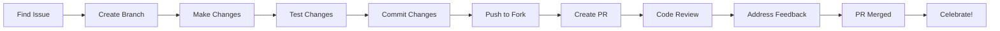

# Contributor Guide

Welcome to the Spreadsheet Moment contributor community! This guide will help you understand how to contribute effectively, regardless of your experience level or skill set.

## What is Contribution?

Contribution comes in many forms. You don't need to be a developer to make valuable contributions!

### Types of Contributions

#### 🧑‍💻 Code Contributions
- Bug fixes
- Feature implementations
- Performance improvements
- Refactoring
- Tests and test improvements
- Documentation in code

#### 📝 Documentation Contributions
- Writing tutorials
- Improving existing docs
- Fixing typos and errors
- Adding examples
- Creating guides
- Translating documentation

#### 🎨 Design Contributions
- UI/UX improvements
- Visual assets and icons
- Templates and themes
- Accessibility improvements
- User research
- Design feedback

#### 💬 Community Contributions
- Helping users in forums
- Answering questions on Discord
- Moderating discussions
- Organizing events
- Community outreach
- Onboarding new members

#### 🧪 Testing & Feedback
- Testing new features
- Reporting bugs
- Providing feedback
- Beta testing
- Quality assurance
- User testing

#### 📢 Content Creation
- Blog posts
- Video tutorials
- Social media content
- Presentations
- Webinars
- Podcast appearances

## Getting Started

### Step 1: Choose Your Contribution Type

Based on your skills and interests, decide how you want to contribute:

#### For Developers
→ Start with [First Contribution](FIRST_CONTRIBUTION.md)
→ Read [PR Workflow](PR_WORKFLOW.md)
→ Review [Code Review Process](CODE_REVIEW.md)

#### For Writers
→ Check [Documentation Guidelines](../docs/STANDARDS.md)
→ Read [Writing Style Guide](../docs/STYLE_GUIDE.md)
→ Use [Document Templates](../docs/TEMPLATES.md)

#### For Designers
→ Join the Design working group on Discord
→ Check design contribution guidelines
→ Review UI/UX contribution process

#### For Community Builders
→ Explore [Community Programs](../programs/README.md)
→ Check [Ambassador Program](../programs/AMBASSADOR.md)
→ Join Community working group

### Step 2: Set Up Your Environment

#### For Code Contributions
1. **Fork the repository** on GitHub
2. **Clone your fork** locally
3. **Set up development environment**:
   ```bash
   git clone https://github.com/YOUR_USERNAME/SuperInstance-papers.git
   cd SuperInstance-papers
   npm install
   npm run dev
   ```
4. **Configure Git**:
   ```bash
   git config user.name "Your Name"
   git config user.email "your.email@example.com"
   ```

#### For Documentation Contributions
1. **Fork the repository** (if contributing via PR)
2. **Join the documentation working group** on Discord
3. **Set up local preview** (optional but recommended)
4. **Review documentation guidelines**

#### For Community Contributions
1. **Join Discord** and introduce yourself
2. **Read community guidelines**
3. **Choose your area** of focus
4. **Start participating** in discussions

### Step 3: Find Something to Contribute

#### Good First Issues
Look for issues labeled:
- `good first issue` - Perfect for beginners
- `help wanted` - Community welcome to contribute
- `documentation` - Docs contributions
- `design` - Design contributions

#### Where to Find Issues
- [GitHub Issues](https://github.com/SuperInstance/SuperInstance-papers/issues)
- Discord `#contributor-help`
- Community forum
- Project boards

#### Create Your Own Contribution
Have an idea? Great!
1. **Search first** to make sure it doesn't exist
2. **Create an issue** to discuss your idea
3. **Get feedback** from maintainers
4. **Start working** once approved

## Contribution Workflow

### For Code Contributions



### 1. Find an Issue
- Browse GitHub issues
- Check Discord `#contributor-help`
- Look at project boards
- Propose your own idea

### 2. Create a Branch
```bash
git checkout -b feature/your-feature-name
# or
git checkout -b fix/issue-number-description
```

### 3. Make Your Changes
- Write clean, well-documented code
- Follow existing code style
- Add tests for new functionality
- Update relevant documentation

### 4. Test Your Changes
```bash
# Run tests
npm test

# Run linter
npm run lint

# Build the project
npm run build

# Test manually
npm run dev
```

### 5. Commit Your Changes
Follow [commit conventions](COMMITS.md):
```bash
git add .
git commit -m "feat: add user authentication"
```

### 6. Push to Your Fork
```bash
git push origin feature/your-feature-name
```

### 7. Create a Pull Request
- Go to your fork on GitHub
- Click "Compare & pull request"
- Fill in the PR template
- Link to related issues
- Submit your PR

### 8. Address Feedback
- Respond to review comments
- Make requested changes
- Push updates to your branch
- Ask questions if anything is unclear

### 9. Celebration! 🎉
- Your PR is merged
- You're now a contributor!
- Update your profile
- Share your achievement

## Contribution Guidelines

### General Guidelines

#### DO:
✅ Be respectful and collaborative
✅ Follow existing patterns and styles
✅ Test your changes thoroughly
✅ Document your work
✅ Respond to feedback promptly
✅ Ask questions when unsure
✅ Start small and build up

#### DON'T:
❌ Make large, uncommented changes
❌ Ignore code review feedback
❌ Skip testing
❌ Break existing functionality
❌ Commit sensitive data
❌ Be discouraged by rejection
❌ Work in isolation

### Code-Specific Guidelines

#### Code Quality
- **Clean code**: Write readable, maintainable code
- **Comments**: Explain "why," not "what"
- **Tests**: Write tests for new functionality
- **Style**: Follow the project's code style
- **Performance**: Consider performance implications

#### Code Review Best Practices
- **Be open** to feedback and suggestions
- **Explain** your decisions clearly
- **Discuss** alternatives respectfully
- **Learn** from reviewers' expertise
- **Thank** reviewers for their time

### Documentation-Specific Guidelines

#### Documentation Quality
- **Clarity**: Write clearly and concisely
- **Accuracy**: Ensure information is correct
- **Completeness**: Cover all necessary details
- **Examples**: Provide helpful examples
- **Accessibility**: Use inclusive language

#### Documentation Review
- **Accuracy**: Technical accuracy check
- **Clarity**: Easy to understand?
- **Completeness**: Missing information?
- **Style**: Consistent with other docs?

## Recognition & Rewards

### Contributor Tiers
- **Contributor**: 1+ merged contributions
- **Active Contributor**: 10+ merged contributions
- **Senior Contributor**: 50+ merged contributions
- **Elite Contributor**: 100+ merged contributions

### Badges & Achievements
- **First Contribution**: Your first merged PR
- **Bug Hunter**: Report 5 confirmed bugs
- **Documentation Master**: 10 doc contributions
- **Code Reviewer**: Review 25 PRs
- **Helper**: Answer 50 questions
- And many more!

### Physical Rewards
- **Stickers**: For first contribution
- **T-shirt**: For 10+ contributions
- **Hoodie**: For 50+ contributions
- **Special swag**: For major contributions

### Career Benefits
- **Portfolio building**: Public contributions
- **Skill development**: Learn from experts
- **Networking**: Connect with professionals
- **Recommendations**: Maintainers can provide references
- **Job opportunities**: Hiring partners look here first

## Getting Help

### Contributor Support
- **Discord `#contributor-help`**: Quick questions
- **GitHub Discussions**: In-depth discussions
- **Office Hours**: Live Q&A with maintainers
- **Mentorship**: Get paired with an experienced contributor

### Resources
- [First Contribution Guide](FIRST_CONTRIBUTION.md): Beginner-friendly
- [PR Workflow](PR_WORKFLOW.md): Step-by-step PR guide
- [Code Review Process](CODE_REVIEW.md): How reviews work
- [Commit Conventions](COMMITS.md): Commit message standards

### When You're Stuck
1. **Search first** - Check docs and issues
2. **Ask on Discord** - `#contributor-help` channel
3. **Create a discussion** - For complex questions
4. **Attend office hours** - For live help
5. **Request a mentor** - For ongoing guidance

## Contributor Stories

### "My First Contribution"
> "I was nervous about contributing, but the community was so supportive. My first PR was just fixing a typo, but it felt amazing to see my code merged!" - Sarah J.

### "From Contributor to Maintainer"
> "I started with small bug fixes, then worked on features, and now I'm a maintainer. The journey was challenging but rewarding." - Marcus T.

### "Non-Code Contributions"
> "I don't code, but I've contributed through documentation and community support. My contributions are valued just as much!" - Priya M.

## Next Steps

### Ready to Contribute?
1. 🎯 Find your first issue
2. 📖 Read the relevant guides
3. 💬 Introduce yourself on Discord
4. 🛠️ Make your first contribution
5. 🎉 Celebrate and keep going!

### Need More Guidance?
- [First Contribution Guide](FIRST_CONTRIBUTION.md): Detailed beginner guide
- [Good First Issues](https://github.com/SuperInstance/SuperInstance-papers/issues?q=is%3Aissue+is%3Aopen+label%3A%22good+first+issue%22): Start here
- [Contributor Help](https://discord.gg/spreadsheetmoment): Ask questions

### Want to Get More Involved?
- [Ambassador Program](../programs/AMBASSADOR.md): Represent the community
- [Mentorship Program](../programs/MENTORSHIP.md): Help newcomers
- [Working Groups](../programs/WORKING_GROUPS.md): Join a team

---

## Thank You! 🙏

Every contribution, no matter how small, helps make Spreadsheet Moment better. We're grateful for your time, energy, and expertise.

**Welcome to the contributor community!** 🎊

---

*Last Updated: 2026-03-15 | Version: 2.0.0 | Maintained by: Contributor Experience Team*
