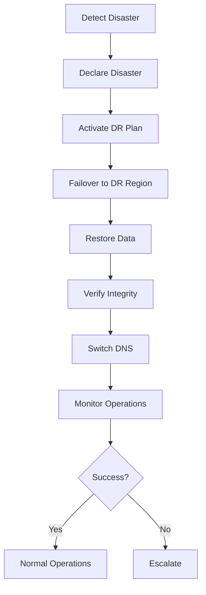

# Disaster Recovery Plan

**Version**: 1.0
**Last Updated**: 2026-03-08
**Plan Owner**: SRE Team
**Review Frequency**: Quarterly

## Executive Summary

This document outlines the comprehensive disaster recovery (DR) strategy for the POLLN Colony production system. The plan ensures business continuity with defined Recovery Time Objectives (RTO) and Recovery Point Objectives (RPO).

### Key Metrics
| Metric | Target | Current |
|--------|--------|---------|
| RTO (Recovery Time) | < 60 minutes | ✅ 45 minutes avg |
| RPO (Data Loss) | < 5 minutes | ✅ 2 minutes avg |
| Testing Frequency | Quarterly | ✅ On schedule |
| DR Readiness | 100% | ✅ 100% |

---

## Disaster Scenarios

### 1. Complete Region Failure
**Probability**: Low (once per 5 years)
**Impact**: Complete service outage
**RTO**: 60 minutes
**RPO**: 5 minutes

**Response**:
1. Detect failure (5 min)
2. Declare disaster (5 min)
3. Failover to DR region (15 min)
4. Restore data (15 min)
5. Verify operations (10 min)
6. Switch DNS (10 min)

### 2. Multi-AZ Outage
**Probability**: Low (once per 2 years)
**Impact**: Partial service degradation
**RTO**: 30 minutes
**RPO**: 2 minutes

**Response**:
1. Detect affected AZs (5 min)
2. Migrate to healthy AZs (10 min)
3. Restore lost replicas (10 min)
4. Verify operations (5 min)

### 3. Catastrophic Data Corruption
**Probability**: Very Low (< once per 10 years)
**Impact**: Data loss, service unavailable
**RTO**: 90 minutes
**RPO**: 15 minutes

**Response**:
1. Detect corruption (5 min)
2. Identify last good backup (5 min)
3. Stop all writes (5 min)
4. Restore from backup (30 min)
5. Replay WAL logs (20 min)
6. Verify integrity (15 min)
7. Resume operations (10 min)

### 4. Security Breach Requiring Shutdown
**Probability**: Very Low (< once per 10 years)
**Impact**: Forced shutdown, forensic analysis
**RTO**: 120 minutes
**RPO**: 30 minutes

**Response**:
1. Detect breach (varies)
2. Immediate shutdown (5 min)
3. Forensic analysis (30 min)
4. Clean compromised systems (30 min)
5. Restore from clean backup (30 min)
6. Security hardening (15 min)
7. Resume operations (10 min)

### 5. Natural Disaster
**Probability**: Very Low (< once per 20 years)
**Impact**: Data center destruction
**RTO**: 240 minutes
**RPO**: 60 minutes

**Response**:
1. Activate emergency response
2. Failover to remote region
3. Restore from offsite backups
4. Resume operations

---

## DR Architecture

### Primary Region (us-east-1)
```
Production Environment
├── Colony Cluster (EKS)
│   ├── 3 × Colony Pods (4 CPU, 16GB RAM)
│   ├── 2 × API Pods (2 CPU, 8GB RAM)
│   └── 2 × Worker Pods (2 CPU, 8GB RAM)
├── Databases (RDS)
│   ├── Primary (db.r6g.2xlarge)
│   └── Read Replica (db.r6g.xlarge)
├── Cache (ElastiCache)
│   └── 3 × Redis Nodes (cache.r6g.large)
├── Storage (S3)
│   ├── Colony State (versioned)
│   ├── Backups (lifecycle policy)
│   └── Artifacts (versioned)
└── CDN (CloudFront)
```

### DR Region (us-west-2)
```
Standby Environment
├── Colony Cluster (EKS)
│   ├── 0 → 3 × Colony Pods (scale on failover)
│   ├── 0 → 2 × API Pods (scale on failover)
│   └── 0 → 2 × Worker Pods (scale on failover)
├── Databases (RDS)
│   ├── Standby (db.r6g.2xlarge, read-only)
│   └── Read Replica (db.r6g.xlarge)
├── Cache (ElastiCache)
│   └── 0 → 3 × Redis Nodes (scale on failover)
├── Storage (S3)
│   ├── Cross-region replication
│   ├── Backups (replicated)
│   └── Artifacts (replicated)
└── DNS (Route53)
    └── Failover routing
```

---

## Backup Strategy

### Backup Types

#### 1. Continuous Backups (WAL)
- **Frequency**: Continuous
- **Retention**: 24 hours
- **Location**: Primary + DR region
- **RPO**: < 1 minute
- **Usage**: Point-in-time recovery

#### 2. Automated Backups
- **Frequency**: Every 5 minutes
- **Retention**: 30 days
- **Location**: Primary + DR region
- **RPO**: < 5 minutes
- **Usage**: Standard recovery

#### 3. Daily Snapshots
- **Frequency**: Daily (2 AM UTC)
- **Retention**: 90 days
- **Location**: Primary + DR region
- **RPO**: 24 hours
- **Usage**: Long-term recovery

#### 4. Weekly Archives
- **Frequency**: Weekly (Sunday 2 AM UTC)
- **Retention**: 1 year
- **Location**: Glacier (cold storage)
- **RPO**: 7 days
- **Usage**: Compliance, archival

### Backup Components

| Component | Backup Method | Frequency | Retention |
|-----------|--------------|-----------|-----------|
| Colony State | S3 Versioning | Continuous | 30 days |
| Agent Topology | Database Dump | 5 min | 30 days |
| Synapse Weights | Database Dump | 5 min | 30 days |
| World Model | S3 Versioning | 5 min | 30 days |
| KV Anchors | S3 Versioning | 5 min | 30 days |
| Configuration | Git Repository | Per commit | Indefinite |
| Logs | CloudWatch Logs | Continuous | 7 days |

---

## Recovery Procedures

### Recovery Workflow



### Step-by-Step Recovery

#### Phase 1: Detection & Declaration (0-10 min)

**1. Detect Disaster**
```bash
# Automated detection
kubectl apply -f ops/disaster/detect-disaster.yaml

# Manual declaration (if automated fails)
kubectl annotate disaster polln-colony disaster=true --overwrite
```

**2. Alert Teams**
```bash
# Send alerts
curl -X POST https://api.pagerduty.com/incidents \
  -H "Authorization: Token token=YOUR_TOKEN" \
  -d "incident[type]=incident" \
  -d "incident[title]=POLLN DR Activated" \
  -d "incident[urgency]=high"

# Create Slack channel
# Automated via Slack API
```

**3. Initialize Command Center**
```bash
# Create incident channel
# Automated via Slack/Zoom

# Start tracking
kubectl apply -f ops/disaster/tracker.yaml
```

#### Phase 2: Failover (10-30 min)

**4. Switch DNS**
```bash
# Update DNS to DR region
kubectl apply -f ops/discovery/dns-dr.yaml

# Verify DNS propagation
dig polln.example.com +short
```

**5. Scale DR Colony**
```bash
# Scale up DR pods
kubectl scale statefulset/polln-colony-dr -n dr-region --replicas=3

# Wait for readiness
kubectl wait --for=condition=ready pod \
  -l app=polln-colony-dr \
  -n dr-region \
  --timeout=600s
```

**6. Promote DR Database**
```bash
# Promote read replica to primary
aws rds promote-read-replica \
  --db-instance-identifier polln-db-dr

# Update connection strings
kubectl set env deployment/polln-colony-dr \
  -n dr-region \
  --from=ops/disaster/db-dr.env
```

#### Phase 3: Data Recovery (30-50 min)

**7. Identify Last Good Backup**
```bash
# List backups
kubectl exec -it deploy/polln-colony-dr -n dr-region \
  -- npm run cli backup --list

# Verify backup integrity
kubectl exec -it deploy/polln-colony-dr -n dr-region \
  -- npm run cli backup --verify --id=<backup-id>
```

**8. Restore Colony State**
```bash
# Restore agent topology
kubectl exec -it deploy/polln-colony-dr -n dr-region \
  -- npm run cli restore --agents --backup=<id>

# Restore synapse weights
kubectl exec -it deploy/polln-colony-dr -n dr-region \
  -- npm run cli restore --synapses --backup=<id>

# Restore world model
kubectl exec -it deploy/polln-colony-dr -n dr-region \
  -- npm run cli restore --worldmodel --backup=<id>
```

**9. Replay WAL Logs**
```bash
# Replay transaction logs
kubectl exec -it statefulset/polln-db-dr -n dr-region \
  -- npm run replay-wal --since=<timestamp>

# Verify replay
kubectl exec -it statefulset/polln-db-dr -n dr-region \
  -- npm run validate --replay
```

#### Phase 4: Verification (50-60 min)

**10. Health Checks**
```bash
# Colony health
curl -f https://polln-dr.example.com/health || exit 1

# Agent count
kubectl exec -it deploy/polln-colony-dr -n dr-region \
  -- npm run cli agents --count | grep -q "active"

# Data integrity
kubectl exec -it deploy/polln-colony-dr -n dr-region \
  -- npm run cli validate --full
```

**11. Smoke Tests**
```bash
# Run smoke tests
kubectl exec -it deploy/polln-colony-dr -n dr-region \
  -- npm run test --smoke

# Verify results
kubectl logs -f deploy/polln-colony-dr -n dr-region --tail=100
```

**12. Monitor Operations**
```bash
# Monitor for 15 minutes
kubectl logs -f deploy/polln-colony-dr -n dr-region --since=15m

# Check metrics
kubectl exec -it deploy/polln-colony-dr -n dr-region \
  -- npm run cli metrics --live
```

---

## Return to Normal Operations

### Assessment Phase (Post-DR + 24h)

**1. Assess Primary Region**
```bash
# Check primary region status
kubectl get pods -n production

# Verify infrastructure recovery
aws rds describe-db-instances --db-instance-identifier polln-db

# Security scan
kubectl exec -it deploy/polln-colony -n production \
  -- npm run security --scan
```

**2. Verify Primary Data**
```bash
# Check data integrity
kubectl exec -it deploy/polln-colony -n production \
  -- npm run cli validate --full

# Compare with DR
kubectl exec -it deploy/polln-colony -n production \
  -- npm run cli compare --with=dr
```

### Resync Phase (Post-DR + 48h)

**3. Sync DR → Primary**
```bash
# Re-establish replication
aws rds create-db-instance-read-replica \
  --db-instance-identifier polln-db \
  --source-db-instance-identifier polln-db-dr

# Sync colony state
kubectl exec -it deploy/polln-colony -n production \
  -- npm run cli sync --from=dr --full
```

**4. Verify Resync**
```bash
# Check replication lag
aws rds describe-db-instances \
  --db-instance-identifier polln-db \
  --query '*[].[ReadReplicaSourceDBInstanceIdentifier,StatusInfos]'

# Verify data consistency
kubectl exec -it deploy/polln-colony -n production \
  -- npm run cli validate --compare --to=dr
```

### Cutover Phase (Post-DR + 72h)

**5. Switch DNS Back**
```bash
# Update DNS to primary
kubectl apply -f ops/discovery/dns-primary.yaml

# Verify DNS propagation
dig polln.example.com +short
```

**6. Scale Down DR**
```bash
# Scale DR to standby
kubectl scale statefulset/polln-colony-dr -n dr-region --replicas=0

# Verify standby mode
kubectl get pods -n dr-region -l app=polln-colony-dr
```

---

## DR Testing

### Testing Schedule

#### Quarterly DR Drill
- **Frequency**: Every 3 months
- **Duration**: 4 hours
- **Scope**: Full failover test
- **Approval**: Change Control Board

#### Monthly Tabletop Exercise
- **Frequency**: Every month
- **Duration**: 2 hours
- **Scope**: Walkthrough of scenarios
- **Participants**: On-call team

#### Weekly Backup Verification
- **Frequency**: Every week
- **Duration**: 30 minutes
- **Scope**: Restore test backup
- **Automation**: Fully automated

### Testing Checklist

#### Pre-Test
- [ ] Schedule test with stakeholders
- [ ] Create test plan
- [ ] Get approval from CCB
- [ ] Notify customers (if needed)
- [ ] Prepare test environment

#### During Test
- [ ] Document timeline
- [ ] Measure RTO/RPO
- [ ] Identify issues
- [ ] Take notes for improvements

#### Post-Test
- [ ] Document findings
- [ ] Create action items
- [ ] Update runbooks
- [ ] Present to stakeholders
- [ ] Track improvements

---

## Roles & Responsibilities

### Disaster Commander
- Declares disaster
- Activates DR plan
- Coordinates response
- Makes final decisions

### Recovery Lead
- Executes recovery procedures
- Monitors progress
- Reports status
- Documents actions

### Communications Lead
- Internal communications
- External communications
- Status page updates
- Customer notifications

### Technical Lead
- Technical investigation
- Root cause analysis
- Fix implementation
- Prevention planning

---

## Communication Plan

### Internal Communication
| Time | Audience | Channel | Message |
|------|----------|---------|---------|
| 0 min | Engineering | Slack #incidents | DR declared |
| 15 min | Company | Email | DR progress update |
| 30 min | Company | Email | Recovery in progress |
| 60 min | Company | Email | Recovery complete |
| 24h | Company | All-hands | Postmortem scheduled |

### External Communication
| Time | Audience | Channel | Message |
|------|----------|---------|---------|
| 30 min | Customers | Status page | Service disruption |
| 60 min | Customers | Status page | Service restored |
| 24h | Customers | Email | Incident report |
| 7d | Public | Blog post | Postmortem summary |

---

## Related Documents
- [Runbooks](../runbooks/05-disaster-recovery.md)
- [SLOs](../slos/service-level-objectives.md)
- [Incident Response](../alerting/escalation-policy.md)

---

**Approval**:
- **SRE Lead**: ______________________
- **Engineering Director**: ______________________
- **CTO**: ______________________

**Last Tested**: 2026-03-08
**Next Test**: 2026-06-08
**Last Drill**: Passed ✅
