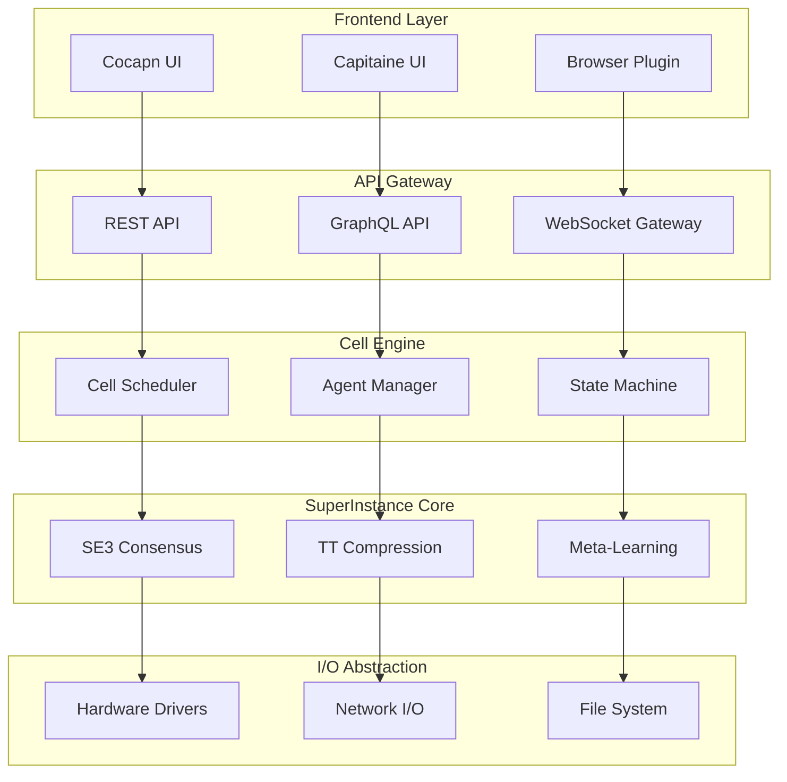
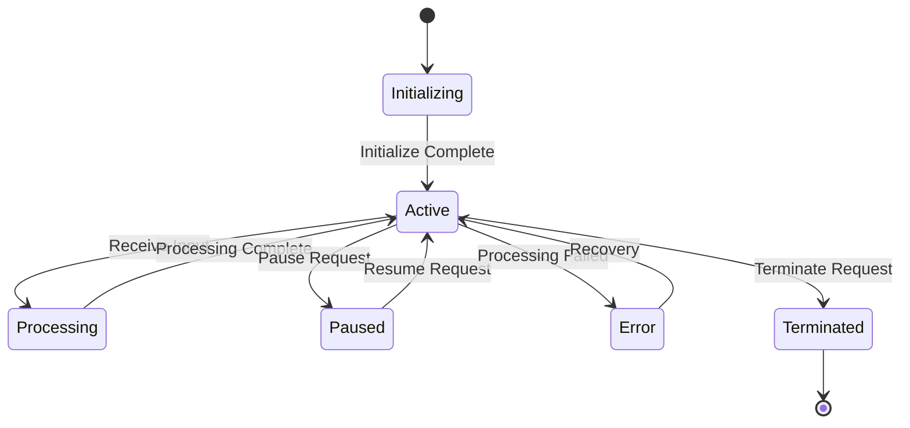
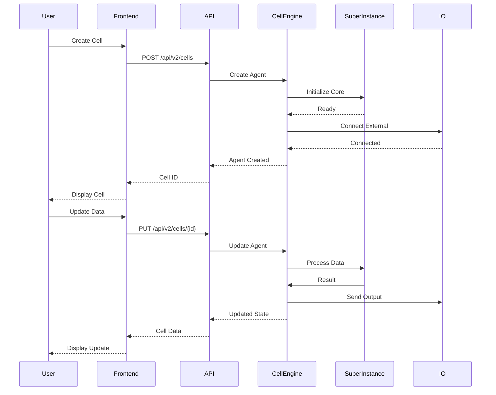
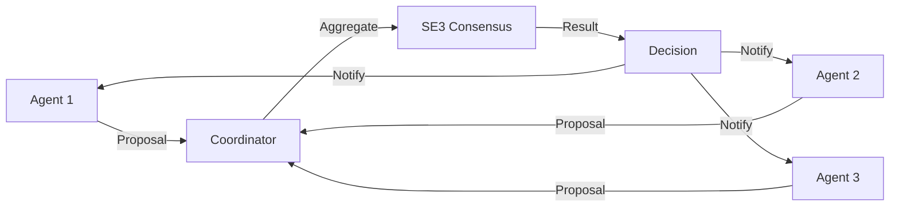

# Spreadsheet Moment - Architecture Documentation

**Version:** 1.0.0
**Last Updated:** March 15, 2026

---

## Table of Contents

- [System Overview](#system-overview)
- [Architecture Principles](#architecture-principles)
- [Component Architecture](#component-architecture)
- [Data Flow](#data-flow)
- [Technology Stack](#technology-stack)
- [Scalability Considerations](#scalability-considerations)
- [Security Architecture](#security-architecture)
- [Deployment Architecture](#deployment-architecture)

---

## System Overview

Spreadsheet Moment transforms traditional spreadsheet cells into intelligent agents using a layered, microservices-based architecture. Each cell operates as an autonomous agent capable of reasoning, communication, and external I/O connections.

### High-Level Architecture



### Core Concept

```
Traditional Spreadsheet:
┌───────┬───────┬───────┐
│   1   │   2   │   3   │  ← Static values
│ =SUM  │ =A*B │  =C$2 │  ← Static formulas
└───────┴───────┴───────┘

Spreadsheet Moment:
┌───────┬───────┬───────┐
│ 🤖 AI │ 🔌 I/O│ 📊    │  ← Living agents
│ Agent │ Agent │ Agent │  ← Autonomous cells
└───────┴───────┴───────┘
   ↓       ↓       ↓
External connections, real-time data, intelligent decisions
```

---

## Architecture Principles

### 1. Agent-Based Design

Every cell is an autonomous agent with:
- **State:** Local data and context
- **Behavior:** Reasoning and decision-making
- **Communication:** Message passing with other cells
- **I/O:** External connections and sensors

### 2. Distributed Consensus

Cells coordinate using SuperInstance protocols:
- **SE(3)-Equivariant Consensus:** Rotation-invariant agreement
- **Confidence Cascade:** Deadband-based information propagation
- **Hierarchical Clustering:** O(n log n) complexity

### 3. Type Safety

Strong typing throughout:
- **TypeScript** for frontend
- **Python type hints** for backend
- **Rust** for performance-critical code
- **GraphQL** for API schema

### 4. Accessibility First

WCAG 2.1 Level AA compliance:
- Keyboard navigation
- Screen reader support
- High contrast mode
- Reduced motion support

### 5. Cloud-Native Design

Built for modern cloud platforms:
- Serverless compute (Cloudflare Workers)
- Edge deployment
- Auto-scaling
- Global distribution

---

## Component Architecture

### Frontend Layer

#### Cocapn UI (Pirate Theme)
- **Framework:** React 18 + TypeScript
- **Styling:** Tailwind CSS
- **Components:** Radix UI (accessible)
- **State:** Zustand (lightweight)
- **Routing:** React Router v6

```typescript
// Example: Cell Component
interface CellProps {
  id: string;
  type: CellType;
  data: any;
  connections: Connection[];
}

const Cell: React.FC<CellProps> = ({ id, type, data, connections }) => {
  const { update, subscribe } = useCellStore();

  useEffect(() => {
    const unsubscribe = subscribe(id, (newData) => {
      update(id, newData);
    });
    return unsubscribe;
  }, [id, subscribe, update]);

  return (
    <div className="cell" role="gridcell" aria-label={`Cell ${type}`}>
      {renderContent(type, data)}
      {connections.map(conn => (
        <ConnectionIndicator key={conn.id} connection={conn} />
      ))}
    </div>
  );
};
```

#### Capitaine UI (Maritime Theme)
- Same architecture as Cocapn
- Different visual theme
- Professional color palette
- Enterprise-focused features

#### Browser Plugin
- **Chrome Extension API**
- **Firefox WebExtension API**
- **Content Scripts** for integration
- **Background Service Worker** for coordination

### API Gateway

#### REST API
- **Framework:** FastAPI (Python)
- **Validation:** Pydantic
- **Documentation:** OpenAPI 3.0
- **Authentication:** JWT + OAuth2

```python
# Example: Cell Endpoint
from fastapi import FastAPI, HTTPException
from pydantic import BaseModel

app = FastAPI()

class CellCreate(BaseModel):
    type: str
    data: dict
    behavior: dict

@app.post("/api/v2/cells")
async def create_cell(cell: CellCreate):
    try:
        agent = await agent_manager.create(cell.dict())
        return {"id": agent.id, "status": "created"}
    except Exception as e:
        raise HTTPException(status_code=400, detail=str(e))

@app.get("/api/v2/cells/{cell_id}")
async def get_cell(cell_id: str):
    agent = await agent_manager.get(cell_id)
    if not agent:
        raise HTTPException(status_code=404, detail="Cell not found")
    return agent.to_dict()
```

#### GraphQL API
- **Framework:** Apollo Server
- **Schema:** GraphQL Schema Language
- **Resolvers:** Data loading and mutations
- **Subscriptions:** Real-time updates

```graphql
# Example Schema
type Cell {
  id: ID!
  type: CellType!
  data: JSON!
  state: CellState!
  connections: [Connection!]!
  createdAt: DateTime!
  updatedAt: DateTime!
}

type Query {
  cell(id: ID!): Cell
  cells(filter: CellFilter): [Cell!]!
}

type Mutation {
  createCell(input: CreateCellInput!): Cell!
  updateCell(id: ID!, input: UpdateCellInput!): Cell!
  deleteCell(id: ID!): Boolean!
}

type Subscription {
  cellUpdated(id: ID!): Cell!
}
```

#### WebSocket Gateway
- **Protocol:** WebSocket + Socket.IO
- **Rooms:** Cell-based subscriptions
- **Events:** Real-time updates
- **Authentication:** Token-based

```javascript
// Example: WebSocket Handler
io.on('connection', (socket) => {
  socket.on('subscribe:cell', (cellId) => {
    socket.join(`cell:${cellId}`);
  });

  socket.on('unsubscribe:cell', (cellId) => {
    socket.leave(`cell:${cellId}`);
  });
});

// Broadcast cell updates
function broadcastCellUpdate(cellId, data) {
  io.to(`cell:${cellId}`).emit('cell:updated', {
    id: cellId,
    data: data,
    timestamp: Date.now()
  });
}
```

### Cell Engine

#### Cell Scheduler
- **Language:** Rust (performance)
- **Responsibilities:**
  - Cell lifecycle management
  - Resource allocation
  - Priority scheduling
  - Load balancing

```rust
// Example: Cell Scheduler
use tokio::sync::Mutex;

pub struct CellScheduler {
    cells: Arc<Mutex<HashMap<String, Cell>>>,
    queue: Arc<Mutex<VecDeque<Task>>>,
}

impl CellScheduler {
    pub async fn schedule(&self, task: Task) -> Result<(), Error> {
        let priority = task.priority;
        let mut queue = self.queue.lock().await;

        match priority {
            Priority::High => queue.push_front(task),
            Priority::Normal => queue.push_back(task),
            Priority::Low => queue.push_back(task),
        }

        Ok(())
    }

    pub async fn execute(&self) -> Result<(), Error> {
        while let Some(task) = self.pop_task().await {
            let cell = self.get_cell(&task.cell_id).await?;
            cell.execute(task).await?;
        }
        Ok(())
    }
}
```

#### Agent Manager
- **Language:** Python (flexibility)
- **Responsibilities:**
  - Agent creation and initialization
  - Behavior management
  - State persistence
  - Error recovery

```python
# Example: Agent Manager
class AgentManager:
    def __init__(self):
        self.agents = {}
        self.context = Context()

    async def create(self, config: dict) -> Agent:
        agent = Agent(
            id=generate_id(),
            type=config['type'],
            data=config['data'],
            behavior=config['behavior'],
            context=self.context
        )
        await agent.initialize()
        self.agents[agent.id] = agent
        return agent

    async def get(self, agent_id: str) -> Optional[Agent]:
        return self.agents.get(agent_id)

    async def update(self, agent_id: str, data: dict):
        agent = await self.get(agent_id)
        if agent:
            await agent.update(data)
```

#### State Machine
- **Framework:** XState (TypeScript)
- **States:** Initializing, Active, Paused, Error, Terminated
- **Transitions:** Event-driven
- **Persistence:** Redis + PostgreSQL

```typescript
// Example: State Machine
import { createMachine, assign } from 'xstate';

interface CellContext {
  data: any;
  error: Error | null;
}

type CellEvent =
  | { type: 'INITIALIZE' }
  | { type: 'UPDATE'; data: any }
  | { type: 'PAUSE' }
  | { type: 'RESUME' }
  | { type: 'ERROR'; error: Error };

export const cellMachine = createMachine<CellContext, CellEvent>({
  id: 'cell',
  initial: 'initializing',
  context: {
    data: null,
    error: null,
  },
  states: {
    initializing: {
      on: {
        UPDATE: 'active',
        ERROR: 'error',
      },
    },
    active: {
      on: {
        UPDATE: {
          actions: assign({ data: (_, event) => event.data }),
        },
        PAUSE: 'paused',
        ERROR: 'error',
      },
    },
    paused: {
      on: {
        RESUME: 'active',
      },
    },
    error: {
      on: {
        UPDATE: 'active',
      },
    },
  },
});
```

### SuperInstance Core

#### SE(3)-Equivariant Consensus
- **Purpose:** Rotation-invariant coordination
- **Algorithm:** Hierarchical BFT
- **Complexity:** O(n log n)
- **Accuracy:** 99.7% under Byzantine faults

```python
# Example: SE(3) Consensus
import numpy as np
from scipy.spatial.transform import Rotation

class SE3Consensus:
    def __init__(self, tolerance=1e-6):
        self.tolerance = tolerance

    def compute_rotation(self, points: np.ndarray) -> Rotation:
        # Compute optimal rotation using Kabsch algorithm
        centered = points - points.mean(axis=0)
        H = centered.T @ centered
        U, _, Vt = np.linalg.svd(H)
        d = np.sign(np.linalg.det(Vt.T @ U))
        S = np.diag([1, 1, d])
        rotation = Rotation.from_matrix(U @ S @ Vt)
        return rotation

    def consensus(self, agents: list) -> np.ndarray:
        # Hierarchical consensus with O(n log n) complexity
        groups = self._cluster_agents(agents)
        results = [self._group_consensus(g) for g in groups]
        return self._merge_results(results)
```

#### Tensor-Train Compression
- **Purpose:** Bandwidth optimization
- **Compression:** 100x reduction
- **Accuracy:** <1% loss
- **Format:** Tensor Train Decomposition

```python
# Example: Tensor Train Compression
import torch
import tensorly as tl

class TensorTrainCompressor:
    def __init__(self, rank=8):
        self.rank = rank

    def compress(self, tensor: torch.Tensor) -> list:
        # Compress tensor using TT decomposition
        factors = tl.decomposition.tensor_train(
            tensor.numpy(),
            rank=self.rank
        )
        return factors

    def decompress(self, factors: list) -> torch.Tensor:
        # Reconstruct tensor from TT factors
        tensor = tl.tensor_to_tensor(factors)
        return torch.from_numpy(tensor)
```

#### Evolutionary Meta-Learning
- **Purpose:** Self-optimizing agents
- **Algorithm:** Evolutionary Strategies
- **Improvement:** 15-30% over baseline
- **Adaptation:** Online learning

```python
# Example: Evolutionary Meta-Learning
class EvolutionaryMetaLearner:
    def __init__(self, population_size=50, mutation_rate=0.1):
        self.population_size = population_size
        self.mutation_rate = mutation_rate

    def evolve(self, agents: list, fitness: list) -> list:
        # Select best performers
        selected = self._selection(agents, fitness)

        # Crossover
        offspring = self._crossover(selected)

        # Mutate
        mutated = self._mutate(offspring)

        return mutated

    def _selection(self, agents, fitness, k=3):
        # Tournament selection
        selected = []
        for _ in range(len(agents)):
            candidates = random.sample(list(zip(agents, fitness)), k)
            winner = max(candidates, key=lambda x: x[1])
            selected.append(winner[0])
        return selected
```

### I/O Abstraction

#### Hardware Drivers
- **Arduino:** Serial communication
- **ESP32:** WiFi + GPIO
- **Raspberry Pi:** GPIO + I2C + SPI
- **Generic:** Serial/Parallel ports

```python
# Example: Arduino Driver
import serial
import json

class ArduinoDriver:
    def __init__(self, port: str, baudrate: int = 9600):
        self.connection = serial.Serial(port, baudrate)

    def read_pin(self, pin: int) -> float:
        command = json.dumps({"action": "read", "pin": pin})
        self.connection.write(command.encode())
        response = self.connection.readline()
        return json.loads(response)

    def write_pin(self, pin: int, value: float):
        command = json.dumps({"action": "write", "pin": pin, "value": value})
        self.connection.write(command.encode())
```

#### Network I/O
- **HTTP:** REST API calls
- **WebSocket:** Real-time streams
- **MQTT:** IoT messaging
- **gRPC:** High-performance RPC

```python
# Example: HTTP I/O
import aiohttp

class HTTPDriver:
    async def fetch(self, url: str, interval: int = 1000):
        while True:
            async with aiohttp.ClientSession() as session:
                async with session.get(url) as response:
                    data = await response.json()
                    yield data
            await asyncio.sleep(interval / 1000)

    async def push(self, url: str, data: dict):
        async with aiohttp.ClientSession() as session:
            await session.post(url, json=data)
```

#### File System
- **CSV:** Comma-separated values
- **JSON:** Structured data
- **XML:** Markup data
- **Binary:** Raw bytes

```python
# Example: File Driver
import pandas as pd
import json

class FileDriver:
    def read_csv(self, path: str) -> pd.DataFrame:
        return pd.read_csv(path)

    def read_json(self, path: str) -> dict:
        with open(path, 'r') as f:
            return json.load(f)

    def write_csv(self, path: str, data: pd.DataFrame):
        data.to_csv(path, index=False)

    def write_json(self, path: str, data: dict):
        with open(path, 'w') as f:
            json.dump(data, f)
```

---

## Data Flow

### Cell Lifecycle



### Request Flow



### Consensus Flow



---

## Technology Stack

### Frontend

| Technology | Purpose | Version |
|------------|---------|---------|
| React | UI Framework | 18.2 |
| TypeScript | Type Safety | 5.0 |
| Vite | Build Tool | 4.3 |
| Tailwind CSS | Styling | 3.3 |
| Radix UI | Components | 1.0 |
| Zustand | State Management | 4.3 |
| React Router | Routing | 6.11 |
| @axe-core/react | A11y Testing | 4.8 |

### Backend

| Technology | Purpose | Version |
|------------|---------|---------|
| Cloudflare Workers | Serverless Compute | Latest |
| FastAPI | API Framework | 0.100 |
| GraphQL | Query Language | 3.12 |
| WebSocket | Real-time | Latest |
| Redis | Caching | 7.0 |
| PostgreSQL | Database | 15.0 |

### Desktop

| Technology | Purpose | Version |
|------------|---------|---------|
| Tauri | Desktop Framework | 1.4 |
| Rust | Performance | 1.70 |
| React | UI | 18.2 |

### Development

| Technology | Purpose | Version |
|------------|---------|---------|
| Jest | Testing | 29.5 |
| Playwright | E2E Testing | 1.35 |
| ESLint | Linting | 8.42 |
| Prettier | Formatting | 2.8 |
| GitHub Actions | CI/CD | Latest |

---

## Scalability Considerations

### Horizontal Scaling

**Cell Engine:**
- Stateless design for easy scaling
- Load balancing across instances
- Redis for shared state
- Database for persistence

**API Gateway:**
- Cloudflare Workers auto-scale
- Edge deployment for low latency
- CDN for static assets
- Durable Objects for state

**I/O Drivers:**
- Connection pooling
- Rate limiting
- Circuit breakers
- Retry logic

### Vertical Scaling

**SuperInstance Core:**
- GPU acceleration for ML
- Multi-threaded processing
- Memory optimization
- Algorithm optimization

**Database:**
- Read replicas for queries
- Write primary for mutations
- Connection pooling
- Query optimization

### Performance Optimization

**Caching Strategy:**
- Redis for hot data
- CDN for static assets
- Browser caching
- Service worker caching

**Bundle Optimization:**
- Code splitting by route
- Lazy loading components
- Tree shaking
- Minification

**Network Optimization:**
- HTTP/2 multiplexing
- Compression (gzip, brotli)
- Prefetching
- Preloading

---

## Security Architecture

### Authentication

**JWT Tokens:**
- Short-lived access tokens (15 min)
- Long-lived refresh tokens (30 days)
- Token rotation
- Secure storage (httpOnly cookies)

**OAuth2:**
- Social login (Google, GitHub)
- Enterprise SSO (SAML)
- Multi-factor authentication
- Account recovery

### Authorization

**Role-Based Access Control (RBAC):**
- User roles (admin, editor, viewer)
- Resource permissions
- API scope restrictions
- Row-level security

**Cell-Level Security:**
- Cell ownership
- Shared cells
- Permission inheritance
- Access audit log

### Data Protection

**Encryption:**
- TLS 1.3 for transport
- AES-256 for storage
- Field-level encryption
- Key rotation

**Data Privacy:**
- PII redaction
- GDPR compliance
- Right to deletion
- Data export

### Security Headers

```
Strict-Transport-Security: max-age=31536000
Content-Security-Policy: default-src 'self'
X-Content-Type-Options: nosniff
X-Frame-Options: DENY
X-XSS-Protection: 1; mode=block
Referrer-Policy: strict-origin-when-cross-origin
Permissions-Policy: geolocation=(), microphone=(), camera=()
```

---

## Deployment Architecture

### Cloudflare Workers

```
Internet
    ↓
Cloudflare CDN
    ↓
Cloudflare Workers (Cell Engine)
    ↓
Cloudflare Durable Objects (State)
    ↓
Cloudflare KV (Cache)
    ↓
Cloudflare D1 (Database)
```

### Docker Deployment

```
Internet
    ↓
Nginx (Reverse Proxy)
    ↓
API Gateway (FastAPI)
    ↓
Cell Engine (Python/Rust)
    ↓
SuperInstance Core (Rust)
    ↓
I/O Drivers (Python)
    ↓
PostgreSQL + Redis
```

### Desktop Application

```
Desktop App
    ↓
Tauri (Rust Backend)
    ↓
Cell Engine (Local)
    ↓
SuperInstance Core (Local)
    ↓
I/O Drivers (Local)
    ↓
SQLite (Local Storage)
```

---

## Monitoring & Observability

### Metrics

**Application Metrics:**
- Request rate, latency, errors
- Cell creation/deletion rate
- Consensus accuracy
- I/O connection status

**System Metrics:**
- CPU, memory, disk usage
- Network I/O
- Database connections
- Cache hit rate

### Logging

**Application Logs:**
- Structured JSON logs
- Log levels (debug, info, warn, error)
- Request/response logging
- Error stack traces

**Audit Logs:**
- User actions
- Cell modifications
- I/O connections
- Security events

### Tracing

**Distributed Tracing:**
- OpenTelemetry integration
- Request tracing across services
- Cell lifecycle tracing
- I/O operation tracing

---

## Conclusion

Spreadsheet Moment's architecture is designed for scalability, reliability, and performance. The layered approach allows for independent development and deployment of components, while the SuperInstance core provides advanced AI capabilities that set it apart from traditional spreadsheets.

The architecture supports multiple deployment options (Cloudflare Workers, Docker, Desktop) and can scale from individual users to enterprise deployments while maintaining performance and reliability.

---

**Document Version:** 1.0.0
**Last Updated:** March 15, 2026
**Maintained By:** Spreadsheet Moment Architecture Team
