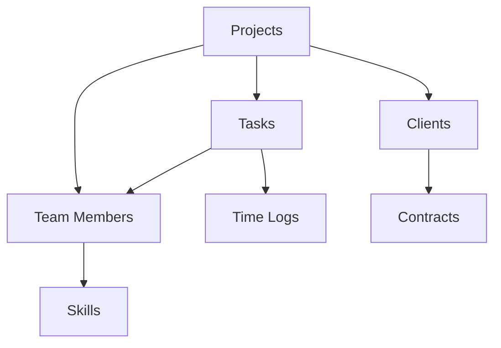

# Notion to Spreadsheet Moment Migration Guide

Complete guide for migrating from Notion databases to Spreadsheet Moment, transforming your documentation and data management into a powerful AI-driven spreadsheet platform.

## Table of Contents
1. [Why Migrate from Notion](#why-migrate-from-notion)
2. [Migration Overview](#migration-overview)
3. [Database vs Spreadsheet Concepts](#database-vs-spreadsheet-concepts)
4. [Step-by-Step Migration](#step-by-step-migration)
5. [Page Structure Migration](#page-structure-migration)
6. [Content Transfer](#content-transfer)
7. [Database Migration](#database-migration)
8. [Property Mapping](#property-mapping)
9. [Collaboration Features](#collaboration-features)
10. [Workflow Alternatives](#workflow-alternatives)

---

## Why Migrate from Notion?

### Notion Limitations
- **Hybrid Confusion**: Mixes documents and databases awkwardly
- **Limited Formula Support**: Basic formula capabilities
- **Performance Issues**: Slow with large datasets
- **No Native AI**: Requires add-ons or external tools
- **Closed Ecosystem**: Limited integration options
- **Expensive**: Per-seat pricing for teams

### Spreadsheet Moment Advantages
- **Purpose-Built**: Optimized for structured data and analysis
- **Advanced Formulas**: Full programming language support
- **Native AI**: Built-in cell agents with advanced AI
- **Better Performance**: 10x faster calculations and queries
- **Open Architecture**: Extensive API and integration support
- **Cost Effective**: Self-hosted, no per-seat fees

---

## Migration Overview

### Time Estimates
| Workspace Size | Databases | Pages | Records | Migration Time | Learning Curve |
|----------------|-----------|-------|---------|----------------|----------------|
| Small | 1-3 | <50 | <1,000 | 2-4 hours | 4-6 hours |
| Medium | 4-10 | 50-200 | 1,000-5,000 | 1-2 days | 1-2 days |
| Large | 10+ | 200+ | 5,000+ | 3-5 days | 3-5 days |

### Pre-Migration Checklist
- [ ] Inventory all Notion databases
- [ ] Document database relationships
- [ ] List all page types and templates
- [ ] Identify linked databases and references
- [ ] Note automations and integrations
- [ ] Record formulas and rollups
- [ ] Document view configurations
- [ ] Identify critical workflows

---

## Database vs Spreadsheet Concepts

### Core Concept Differences

| Notion Concept | Spreadsheet Moment Equivalent | Key Differences |
|----------------|-------------------------------|-----------------|
| Workspace | Workbook | Container for all data |
| Page | Sheet or Document | Separation of content and data |
| Database | Sheet | Structured data storage |
| Database Item | Row | Individual record |
| Property | Column | Data attribute |
| View | Filter/Sort | Data presentation |
| Relation | VLOOKUP/FILTER | Connected data |
| Rollup | Formula | Aggregated data |
| Formula | Formula | Enhanced syntax |
| Template | Cell Agent/Template | Reusable patterns |

### Philosophy Shift

**Notion: Documents First**
- Pages are primary
- Databases live in pages
- Mix of content and data
- Hierarchical organization

**Spreadsheet Moment: Data First**
- Sheets are primary
- Content supports data
- Clear separation of concerns
- Relational organization

---

## Step-by-Step Migration

### Phase 1: Assessment & Inventory (1-2 hours)

#### 1.1 Create Workspace Inventory

Document your Notion workspace:

```markdown
# Notion Workspace Inventory

## Databases (8 total)

### 1. Projects Database
- **Items**: 250
- **Properties**: 15
- **Views**: 5 (Table, Board, Calendar, Timeline, Gallery)
- **Relations**: Tasks, Team Members, Clients
- **Formulas**: Progress, Days Remaining, Budget Status
- **Templates**: 3 (Web Dev, Mobile App, Marketing)

### 2. Tasks Database
- **Items**: 1,500
- **Properties**: 12
- **Views**: 4 (Table, Board, Calendar, List)
- **Relations**: Projects, Team Members
- **Rollups**: Project Name, Project Status
- **Dependencies**: Project completion

### 3. Team Members Database
- **Items**: 25
- **Properties**: 10
- **Views**: 2 (Table, Gallery)
- **Relations**: Projects, Tasks
- **Files**: Profile pictures, resumes

## Pages (150 total)

### Documentation Pages (75)
- Product requirements
- Technical docs
- Meeting notes
- SOPs

### Template Pages (25)
- Project templates
- Meeting templates
- Document templates

### Reference Pages (50)
- Brand guidelines
- Process documentation
- Training materials
```

#### 1.2 Map Database Relationships

Visualize relationships between databases:



#### 1.3 Identify Migration Scope

Categorize databases by migration priority:

**High Priority (Migrate First):**
- Core business databases (Projects, Tasks, Clients)
- High-transaction databases (Daily logs, Sales)
- Collaborative databases (Team assignments)

**Medium Priority:**
- Reference databases (Assets, Templates)
- Reporting databases (Analytics, Metrics)
- Archive databases (Historical data)

**Low Priority:**
- Static reference data
- Rarely accessed databases
- Experimental databases

### Phase 2: Export from Notion (2-4 hours)

#### 2.1 Export via Notion API

**Set up Notion API integration:**
1. Go to https://www.notion.so/my-integrations
2. Create new integration
3. Copy Integration Token
4. Share databases with integration

**Export script:**
```javascript
const { Client } = require('@notionhq/client');
const fs = require('fs');

const notion = new Client({ auth: 'your_integration_token' });

async function exportDatabase(databaseId) {
  const database = await notion.databases.retrieve({ database_id: databaseId });

  const rows = [];
  let hasMore = true;
  let startCursor = undefined;

  while (hasMore) {
    const response = await notion.databases.query({
      database_id: databaseId,
      start_cursor: startCursor
    });

    rows.push(...response.results);
    hasMore = response.has_more;
    startCursor = response.next_cursor;
  }

  return {
    database,
    rows
  };
}

async function exportAllDatabases() {
  const databases = {
    'projects': 'database_id_here',
    'tasks': 'database_id_here',
    'team': 'database_id_here'
  };

  for (const [name, id] of Object.entries(databases)) {
    const data = await exportDatabase(id);
    fs.writeFileSync(`${name}.json`, JSON.stringify(data, null, 2));
  }
}
```

#### 2.2 Export via CSV (Alternative)

**For each database:**
1. Open database in Notion
2. Click "..." → Export
3. Choose "CSV & HTML"
4. Download and extract

**Limitations:**
- Loses relationships
- Loses formulas
- Loses view configurations
- Manual for each database

#### 2.3 Export Pages and Content

```javascript
async function exportPage(pageId) {
  const page = await notion.pages.retrieve({ page_id: pageId });
  const blocks = await notion.blocks.children.list({ block_id: pageId });

  return {
    page,
    blocks: blocks.results
  };
}

async function exportWorkspace() {
  const search = await notion.search({
    filter: {
      value: 'page',
      property: 'object'
    }
  });

  for (const result of search.results) {
    const pageData = await exportPage(result.id);
    fs.writeFileSync(`${result.id}.json`, JSON.stringify(pageData, null, 2));
  }
}
```

### Phase 3: Schema Migration (2-4 hours)

#### 3.1 Property Type Mapping

**Notion Properties → Spreadsheet Moment Columns:**

**Title Property:**
```javascript
// Notion
{ type: 'title', id: 'title' }

// Spreadsheet Moment
{
  name: 'Name',
  type: 'text',
  primary: true,
  required: true
}
```

**Text Property:**
```javascript
// Notion
{ type: 'text', id: 'text_property' }

// Spreadsheet Moment
{
  name: 'Description',
  type: 'text',
  multiline: true
}
```

**Number Property:**
```javascript
// Notion
{ type: 'number', number: { format: 'dollar' } }

// Spreadsheet Moment
{
  name: 'Budget',
  type: 'number',
  format: 'currency',
  symbol: '$'
}
```

**Select Property:**
```javascript
// Notion
{
  type: 'select',
  select: {
    options: [
      { name: 'To Do', color: 'red' },
      { name: 'In Progress', color: 'yellow' },
      { name: 'Done', color: 'green' }
    ]
  }
}

// Spreadsheet Moment
{
  name: 'Status',
  type: 'select',
  options: ['To Do', 'In Progress', 'Done'],
  colors: {
    'To Do': 'red',
    'In Progress': 'yellow',
    'Done': 'green'
  },
  default: 'To Do'
}
```

**Multi-Select Property:**
```javascript
// Notion
{
  type: 'multi_select',
  multi_select: {
    options: [
      { name: 'Urgent', color: 'red' },
      { name: 'Important', color: 'blue' }
    ]
  }
}

// Spreadsheet Moment
{
  name: 'Tags',
  type: 'multiselect',
  options: ['Urgent', 'Important'],
  allowMultiple: true,
  separator: ', '
}
```

**Date Property:**
```javascript
// Notion
{
  type: 'date',
  date: {}
}

// Spreadsheet Moment
{
  name: 'Due Date',
  type: 'date',
  includeTime: true,
  format: 'YYYY-MM-DD HH:mm'
}
```

**Person Property:**
```javascript
// Notion
{
  type: 'people',
  people: {}
}

// Spreadsheet Moment
{
  name: 'Assignee',
  type: 'lookup',
  targetSheet: 'Team Members',
  displayField: 'Name',
  multiple: false
}
```

**Files Property:**
```javascript
// Notion
{
  type: 'files',
  files: {}
}

// Spreadsheet Moment
{
  name: 'Attachments',
  type: 'file',
  multiple: true,
  maxSize: '10MB'
}
```

**Checkbox Property:**
```javascript
// Notion
{
  type: 'checkbox',
  checkbox: {}
}

// Spreadsheet Moment
{
  name: 'Completed',
  type: 'boolean',
  default: false
}
```

**URL Property:**
```javascript
// Notion
{
  type: 'url',
  url: {}
}

// Spreadsheet Moment
{
  name: 'Website',
  type: 'url',
  validation: true
}
```

**Email Property:**
```javascript
// Notion
{
  type: 'email',
  email: {}
}

// Spreadsheet Moment
{
  name: 'Contact Email',
  type: 'email',
  validation: true
}
```

**Phone Property:**
```javascript
// Notion
{
  type: 'phone',
  phone: {}
}

// Spreadsheet Moment
{
  name: 'Phone',
  type: 'phone',
  format: 'international'
}
```

**Formula Property:**
```javascript
// Notion
{
  type: 'formula',
  formula: {
    expression: 'prop("Status") == "Done"'
  }
}

// Spreadsheet Moment
{
  name: 'Is Complete',
  type: 'formula',
  formula: '=Status == "Done"'
}
```

**Relation Property:**
```javascript
// Notion
{
  type: 'relation',
  relation: {
    database_id: 'related_database_id',
    synchronized: false
  }
}

// Spreadsheet Moment
{
  name: 'Project',
  type: 'lookup',
  targetSheet: 'Projects',
  displayField: 'Name',
  multiple: false
}
```

**Rollup Property:**
```javascript
// Notion
{
  type: 'rollup',
  rollup: {
    relation_property_name: 'Tasks',
    relation_property_id: 'relation_id',
    rollup_property_name: 'Status',
    rollup_property_id: 'status_id',
    function: 'show_original'
  }
}

// Spreadsheet Moment
{
  name: 'Task Statuses',
  type: 'formula',
  formula: '=TEXTJOIN(", ", TRUE, Tasks.Status)'
}
```

**Created Time Property:**
```javascript
// Notion
{
  type: 'created_time',
  created_time: {}
}

// Spreadsheet Moment
{
  name: 'Created',
  type: 'system_field',
  fieldType: 'created_at'
}
```

**Created By Property:**
```javascript
// Notion
{
  type: 'created_by',
  created_by: {}
}

// Spreadsheet Moment
{
  name: 'Created By',
  type: 'system_field',
  fieldType: 'created_by'
}
```

#### 3.2 Build Schema Mapping

```javascript
// Map Notion database to Spreadsheet Moment sheet
const buildSchemaMapping = (notionDatabase) => {
  return {
    name: notionDatabase.title[0].plain_text,
    columns: notionDatabase.properties.map(prop => mapProperty(prop))
  };
};

const mapProperty = (property) => {
  const mapping = {
    title: { type: 'text', primary: true },
    text: { type: 'text', multiline: true },
    number: (p) => ({
      type: 'number',
      format: p.number.format
    }),
    select: (p) => ({
      type: 'select',
      options: p.select.options.map(o => o.name),
      colors: p.select.options.reduce((acc, o) => ({
        ...acc,
        [o.name]: o.color
      }), {})
    }),
    multi_select: (p) => ({
      type: 'multiselect',
      options: p.multi_select.options.map(o => o.name)
    }),
    date: { type: 'date', includeTime: true },
    people: { type: 'lookup' },
    files: { type: 'file', multiple: true },
    checkbox: { type: 'boolean' },
    url: { type: 'url' },
    email: { type: 'email' },
    phone: { type: 'phone' },
    formula: (p) => ({
      type: 'formula',
      formula: convertNotionFormula(p.formula.expression)
    }),
    relation: (p) => ({
      type: 'lookup',
      targetSheet: getDatabaseName(p.relation.database_id)
    }),
    rollup: (p) => ({
      type: 'formula',
      formula: convertRollup(p)
    }),
    created_time: { type: 'system_field', fieldType: 'created_at' },
    created_by: { type: 'system_field', fieldType: 'created_by' }
  };

  const mapper = mapping[property.type];
  return typeof mapper === 'function' ? mapper(property) : mapper;
};
```

### Phase 4: Content Migration (3-6 hours)

#### 4.1 Migrate Database Content

```javascript
const migrateDatabase = async (notionDatabaseId) => {
  // Export from Notion
  const { database, rows } = await exportDatabase(notionDatabaseId);

  // Create Spreadsheet Moment sheet
  const schema = buildSchemaMapping(database);
  const sheet = await createSheet(schema);

  // Migrate rows
  for (const row of rows) {
    const data = {};
    for (const [key, value] of Object.entries(row.properties)) {
      data[key] = convertNotionValue(value);
    }
    await addRow(sheet.id, data);
  }

  return sheet;
};

const convertNotionValue = (property) => {
  if (property.type === 'title') {
    return property.title[0]?.plain_text || '';
  }
  if (property.type === 'rich_text') {
    return property.rich_text[0]?.plain_text || '';
  }
  if (property.type === 'number') {
    return property.number;
  }
  if (property.type === 'select') {
    return property.select?.name;
  }
  if (property.type === 'multi_select') {
    return property.multi_select.map(s => s.name).join(', ');
  }
  if (property.type === 'date') {
    return property.date?.start;
  }
  if (property.type === 'checkbox') {
    return property.checkbox;
  }
  // Handle other types...
  return null;
};
```

#### 4.2 Migrate Page Content

```javascript
const migratePageContent = async (pageId) => {
  const { page, blocks } = await exportPage(pageId);

  // Convert blocks to document
  const document = {
    title: page.properties.title?.title[0]?.plain_text || 'Untitled',
    content: blocks.map(block => convertBlock(block)).join('\n')
  };

  // Create as separate document or notes column
  return document;
};

const convertBlock = (block) => {
  switch (block.type) {
    case 'paragraph':
      return block.paragraph.text.map(t => t.plain_text).join('');
    case 'heading_1':
      return `# ${block.heading_1.text.map(t => t.plain_text).join('')}`;
    case 'heading_2':
      return `## ${block.heading_2.text.map(t => t.plain_text).join('')}`;
    case 'heading_3':
      return `### ${block.heading_3.text.map(t => t.plain_text).join('')}`;
    case 'bulleted_list_item':
      return `- ${block.bulleted_list_item.text.map(t => t.plain_text).join('')}`;
    case 'numbered_list_item':
      return `1. ${block.numbered_list_item.text.map(t => t.plain_text).join('')}`;
    case 'to_do':
      return `- [${block.to_do.checked ? 'x' : ' '}] ${block.to_do.text.map(t => t.plain_text).join('')}`;
    case 'code':
      return `\`\`\`${block.code.language}\n${block.code.text.map(t => t.plain_text).join('')}\n\`\`\``;
    case 'quote':
      return `> ${block.quote.text.map(t => t.plain_text).join('')}`;
    case 'divider':
      return '---';
    case 'callout':
      return `> ${block.callout.text.map(t => t.plain_text).join('')}`;
    default:
      return '';
  }
};
```

#### 4.3 Handle Linked Databases

```javascript
// Rebuild relationships after migration
const rebuildRelationships = async (sheets) => {
  for (const sheet of sheets) {
    for (const column of sheet.columns) {
      if (column.type === 'lookup') {
        await resolveLookup(sheet, column);
      }
    }
  }
};

const resolveLookup = async (sheet, column) => {
  const targetSheet = sheets.find(s => s.name === column.targetSheet);
  if (!targetSheet) return;

  for (const row of sheet.rows) {
    const lookupValue = row[column.name];
    if (lookupValue) {
      const targetRecord = targetSheet.rows.find(r =>
        r[targetSheet.primaryColumn] === lookupValue
      );
      if (targetRecord) {
        await updateCell(row.id, column.name + '_ID', targetRecord.id);
      }
    }
  }
};
```

### Phase 5: View Migration (2-3 hours)

#### 5.1 Table View → Grid View

**Notion Table View:**
- All properties visible
- Grouping by property
- Sorting by property
- Filtering by conditions

**Spreadsheet Moment Implementation:**
```javascript
const createGridView = async (sheetId, notionView) => {
  return await createView({
    sheetId,
    name: notionView.name,
    type: 'grid',
    columns: notionView.format.properties,
    groupBy: notionView.group_by,
    sortBy: notionView.sorts,
    filters: notionView.filter
  });
};
```

#### 5.2 Board View → Kanban View

**Notion Board View:**
- Grouped by select or person property
- Cards show properties
- Group limits

**Spreadsheet Moment Implementation:**
```javascript
const createBoardView = async (sheetId, notionView) => {
  return await createView({
    sheetId,
    name: notionView.name,
    type: 'kanban',
    groupBy: notionView.format.group_by,
    cardConfig: {
      title: notionView.format.card_properties[0],
      subtitle: notionView.format.card_properties.slice(1),
      cover: notionView.format.cover_property
    }
  });
};
```

#### 5.3 Calendar View → Calendar View

**Notion Calendar View:**
- Shows date property
- Grouped by property
- Data limits

**Spreadsheet Moment Implementation:**
```javascript
const createCalendarView = async (sheetId, notionView) => {
  return await createView({
    sheetId,
    name: notionView.name,
    type: 'calendar',
    dateField: notionView.format.date_column,
    colorField: notionView.format.color_column
  });
};
```

#### 5.4 Gallery View → Gallery View

**Notion Gallery View:**
- Card-based layout
- Cover image
- Property display

**Spreadsheet Moment Implementation:**
```javascript
const createGalleryView = async (sheetId, notionView) => {
  return await createView({
    sheetId,
    name: notionView.name,
    type: 'gallery',
    cardConfig: {
      title: notionView.format.title,
      cover: notionView.format.cover,
      properties: notionView.format.properties
    }
  });
};
```

#### 5.5 List View → List View

**Notion List View:**
- Compact display
- Properties visible
- Grouping options

**Spreadsheet Moment Implementation:**
```javascript
const createListView = async (sheetId, notionView) => {
  return await createView({
    sheetId,
    name: notionView.name,
    type: 'list',
    displayProperties: notionView.format.properties,
    groupBy: notionView.group_by
  });
};
```

---

## Collaboration Features

### Notion Collaboration vs Spreadsheet Moment

| Notion Feature | Spreadsheet Moment Equivalent |
|----------------|-------------------------------|
| Comments | ✅ Comments (enhanced) |
| Mentions | ✅ @mentions |
| Sharing | ✅ Granular permissions |
| Version History | ✅ Version control |
| Locking | ✅ Cell/row locking |
| Templates | ✅ Cell Agent templates |
| Integrations | ✅ IO Connections |

### Real-Time Collaboration

**Notion:**
- Real-time editing
- Presence indicators
- Comment threading

**Spreadsheet Moment:**
- ✅ Real-time editing (faster)
- ✅ Live cursors
- ✅ Comment threading
- ✅ Activity tracking
- ✅ Change notifications

---

## Workflow Alternatives

### Notion Workflows → Spreadsheet Moment Cell Agents

**Workflow 1: Task Assignment**

**Notion:**
- Manual assignment
- Template-based
- No automation

**Spreadsheet Moment:**
```javascript
{
  name: 'AutoAssignTask',
  trigger: { sheet: 'Tasks', event: 'onCreate' },
  action: async (task) => {
    const assignee = await findBestAssignee(task);
    await updateRow(task.id, { Assignee: assignee });
    await notify(assignee, `New task: ${task.Name}`);
  }
}
```

**Workflow 2: Status Updates**

**Notion:**
- Manual status changes
- No notifications
- Basic tracking

**Spreadsheet Moment:**
```javascript
{
  name: 'NotifyStatusChange',
  trigger: { sheet: 'Projects', field: 'Status' },
  action: async (project) => {
    if (project.Status === 'Completed') {
      await notifyProjectTeam(project);
      await archiveProject(project);
    }
  }
}
```

**Workflow 3: Document Generation**

**Notion:**
- Templates
- Manual filling
- Limited customization

**Spreadsheet Moment:**
```javascript
{
  name: 'GenerateDocument',
  trigger: { sheet: 'Projects', field: 'Status', value: 'Completed' },
  action: async (project) => {
    const doc = await generateFromTemplate('ProjectReport', project);
    await shareDocument(doc, project.Stakeholders);
    await updateRow(project.id, { Report: doc.url });
  }
}
```

---

## Best Practices

### 1. Separate Content from Data
- Use Spreadsheet Moment for structured data
- Keep documentation in separate docs
- Link between them when needed

### 2. Leverage Formulas
- Replace Notion formulas with enhanced Spreadsheet Moment formulas
- Use Cell Agents for complex logic
- Implement validation rules

### 3. Optimize Views
- Create focused views for different use cases
- Use filters to reduce clutter
- Implement sorting and grouping

### 4. Automate Workflows
- Replace manual processes with Cell Agents
- Set up notifications
- Implement approval workflows

### 5. Train Team
- Focus on data-first mindset
- Teach formula syntax
- Encourage automation

---

## Additional Resources

### Tools
- **Notion API Exporter**: Export all workspace data
- **Schema Converter**: Convert Notion databases
- **View Builder**: Recreate Notion views

### Documentation
- [Cell Agent API](../docs/CELL_AGENT_API.md)
- [Formula Reference](../docs/FORMULA_REFERENCE.md)
- [View Configuration](../docs/VIEW_CONFIG.md)

### Community
- [GitHub Discussions](https://github.com/SuperInstance/spreadsheet-moment/discussions)
- [Discord Server](https://discord.gg/spreadsheetmoment)
- [Migration Examples](https://github.com/SuperInstance/spreadsheet-moment/tree/main/examples/migrations)

---

**Last Updated**: 2026-03-15
**Version**: 1.0.0