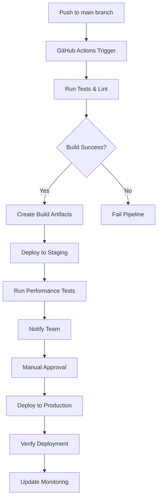

# SuperInstance Website Deployment Guide

This document provides comprehensive deployment instructions for the SuperInstance website, including CI/CD workflows, environment management, monitoring, and troubleshooting.

## Table of Contents

1. [Overview](#overview)
2. [Architecture](#architecture)
3. [Environments](#environments)
4. [CI/CD Workflows](#cicd-workflows)
5. [Deployment Process](#deployment-process)
6. [Monitoring & Observability](#monitoring--observability)
7. [Backup & Recovery](#backup--recovery)
8. [Troubleshooting](#troubleshooting)
9. [Security Considerations](#security-considerations)
10. [Performance Optimization](#performance-optimization)

## Overview

The SuperInstance website is a static site built with [Astro](https://astro.build) and deployed to [Cloudflare Pages](https://pages.cloudflare.com). The deployment infrastructure includes:

- **CI/CD**: GitHub Actions for automated testing and deployment
- **Environments**: Development, Preview, Staging, Production
- **Monitoring**: Cloudflare Analytics, Error Tracking, Performance Monitoring
- **Backup**: Automated daily backups via GitHub Actions
- **Security**: Regular vulnerability scanning and dependency updates

## Architecture

```
┌─────────────────────────────────────────────────────────────┐
│                     GitHub Repository                        │
│  ┌─────────────────────────────────────────────────────┐    │
│  │  Main Branch                                        │    │
│  │  ┌─────────────┐  ┌─────────────┐  ┌─────────────┐ │    │
│  │  │   Source    │  │   Tests     │  │   Build     │ │    │
│  │  │   Code      │  │   Pass      │  │   Artifacts │ │    │
│  │  └─────────────┘  └─────────────┘  └─────────────┘ │    │
│  └─────────────────────────────────────────────────────┘    │
└─────────────────────────────────────────────────────────────┘
                                │
                                ▼
┌─────────────────────────────────────────────────────────────┐
│                   GitHub Actions CI/CD                       │
│  ┌─────────────┐  ┌─────────────┐  ┌─────────────┐         │
│  │   Lint &    │  │   Build &   │  │   Security  │         │
│  │   Test      │  │   Deploy    │  │   Scan      │         │
│  └─────────────┘  └─────────────┘  └─────────────┘         │
└─────────────────────────────────────────────────────────────┘
                                │
                                ▼
┌─────────────────────────────────────────────────────────────┐
│                   Cloudflare Pages                           │
│  ┌─────────────┐  ┌─────────────┐  ┌─────────────┐         │
│  │   Preview   │  │   Staging   │  │ Production  │         │
│  │   (PRs)     │  │   (Main)    │  │  (Manual)   │         │
│  └─────────────┘  └─────────────┘  └─────────────┘         │
└─────────────────────────────────────────────────────────────┘
                                │
                                ▼
┌─────────────────────────────────────────────────────────────┐
│                   Monitoring & Analytics                     │
│  ┌─────────────┐  ┌─────────────┐  ┌─────────────┐         │
│  │ Cloudflare  │  │ Performance │  │   Error     │         │
│  │  Analytics  │  │  Monitoring │  │  Tracking   │         │
│  └─────────────┘  └─────────────┘  └─────────────┘         │
└─────────────────────────────────────────────────────────────┘
```

## Environments

### Development (`development`)
- **URL**: `http://localhost:4321`
- **Purpose**: Local development and testing
- **Features**: Experimental features enabled, analytics disabled
- **Deployment**: Local only via `npm run dev`

### Preview (`preview`)
- **URL**: `https://preview.superinstance.ai`
- **Purpose**: Pull Request previews
- **Features**: Experimental features enabled, limited analytics
- **Deployment**: Automatic on PR creation

### Staging (`staging`)
- **URL**: `https://staging.superinstance.ai`
- **Purpose**: Pre-production testing
- **Features**: Production-like configuration, full monitoring
- **Deployment**: Automatic on push to `main` branch

### Production (`production`)
- **URL**: `https://superinstance.ai`
- **Purpose**: Live production website
- **Features**: Full production configuration, all monitoring enabled
- **Deployment**: Manual via GitHub Actions workflow dispatch

## CI/CD Workflows

### 1. Website Deployment (`website-deploy.yml`)
**Trigger**: Push to `main` branch or Pull Request
**Jobs**:
- `test-and-build`: Lint, test, and build website
- `deploy-preview`: Deploy PR previews to Cloudflare Pages
- `deploy-staging`: Deploy to staging environment
- `deploy-production`: Manual deployment to production
- `monitor-performance`: Run Lighthouse performance tests

### 2. Security Scanning (`security-scan.yml`)
**Trigger**: Weekly schedule or manual
**Jobs**:
- `security-scan`: npm audit, Snyk, secret detection
- `code-quality`: ESLint, security pattern checks
- `container-scan`: Docker container security (if applicable)

### 3. Dependency Updates (`dependency-updates.yml`)
**Trigger**: Weekly schedule or manual
**Jobs**:
- `check-updates`: Check for outdated dependencies
- `auto-update`: Create PR with dependency updates (optional)

### 4. Backup & Recovery (`backup-recovery.yml`)
**Trigger**: Daily schedule or manual
**Jobs**:
- `backup-content`: Backup source code, config, and build artifacts
- `recovery-test`: Test disaster recovery process (manual)

## Deployment Process

### Manual Deployment to Production

1. **Prerequisites**:
   - GitHub repository access
   - Cloudflare API token with Pages write access
   - Secrets configured in GitHub repository

2. **Steps**:
   ```bash
   # 1. Ensure tests pass locally
   cd website
   npm run test:all

   # 2. Build locally to verify
   npm run build

   # 3. Trigger production deployment via GitHub Actions
   # - Go to GitHub Actions → "Deploy SuperInstance Website to Cloudflare"
   # - Click "Run workflow" → Select "main" branch
   # - Wait for deployment to complete
   ```

3. **Verification**:
   - Check Cloudflare Pages dashboard
   - Verify deployment at https://superinstance.ai
   - Review monitoring dashboards
   - Run smoke tests

### Automated Deployment Flow



## Monitoring & Observability

### Cloudflare Analytics
- **Access**: Cloudflare Dashboard → Analytics
- **Metrics**: Requests, bandwidth, visitors, page views
- **Configuration**: Enabled via `monitoring.config.js`

### Performance Monitoring
- **Lighthouse CI**: Integrated in deployment pipeline
- **Core Web Vitals**: CLS, FID, LCP, FCP, TTFB
- **Alerts**: Configured in `monitoring.config.js`

### Error Tracking
- **Cloudflare Error Pages**: Automatic error tracking
- **Custom Error Handling**: Client-side error reporting
- **Alerting**: Error rate thresholds

### Uptime Monitoring
- **Cloudflare Uptime**: Synthetic monitoring
- **Health Checks**: `/health` endpoint
- **Regions**: NAM, EU, APAC

## Backup & Recovery

### Daily Backups
- **Schedule**: Daily at 3 AM UTC
- **Contents**: Source code, configuration, build artifacts
- **Retention**: 90 days in GitHub Actions artifacts
- **Location**: GitHub repository → Actions → Artifacts

### Recovery Process

1. **Identify Disaster Scenario**:
   - Data loss
   - Deployment failure
   - Security breach

2. **Access Backups**:
   ```bash
   # Download latest backup from GitHub Actions
   # Go to: https://github.com/[owner]/[repo]/actions
   # Find latest backup workflow run
   # Download artifacts
   ```

3. **Restore Process**:
   ```bash
   # Extract source code
   tar -xzf website-source-YYYYMMDD_HHMMSS.tar.gz

   # Extract configuration
   tar -xzf website-config-YYYYMMDD_HHMMSS.tar.gz

   # Restore build artifacts (if needed)
   tar -xzf build-output-YYYYMMDD_HHMMSS.tar.gz

   # Install dependencies
   npm ci

   # Deploy to Cloudflare Pages
   npm run deploy:production
   ```

4. **Verification**:
   - Test restored website
   - Verify functionality
   - Check monitoring

### Disaster Recovery Testing
- **Frequency**: Quarterly or after major changes
- **Process**: Run `recovery-test` job manually
- **Documentation**: Update recovery procedures based on test results

## Troubleshooting

### Common Issues

#### Deployment Failures

**Issue**: Build fails in CI/CD
**Solution**:
1. Check GitHub Actions logs
2. Verify Node.js version compatibility
3. Check for missing dependencies
4. Review build errors in logs

**Issue**: Cloudflare Pages deployment fails
**Solution**:
1. Check Cloudflare Pages dashboard
2. Verify API token permissions
3. Check wrangler.toml configuration
4. Review build output directory

#### Performance Issues

**Issue**: Slow page loads
**Solution**:
1. Check Lighthouse CI results
2. Review Core Web Vitals
3. Optimize images and assets
4. Enable Cloudflare Cache

**Issue**: High error rates
**Solution**:
1. Check error tracking dashboard
2. Review client-side errors
3. Check API endpoints
4. Review recent changes

#### Monitoring Issues

**Issue**: Analytics not tracking
**Solution**:
1. Verify Cloudflare Analytics configuration
2. Check if running in development mode
3. Verify DNS settings
4. Check browser console for errors

**Issue**: Alerts not firing
**Solution**:
1. Check alert configuration
2. Verify notification channels
3. Test alert thresholds
4. Review monitoring service status

### Debugging Commands

```bash
# Local development
cd website
npm run dev          # Start development server
npm run build        # Build for production
npm run preview      # Preview build locally

# Testing
npm test             # Run unit tests
npm run test:e2e     # Run end-to-end tests
npm run test:all     # Run all tests

# Deployment
npm run deploy:staging     # Deploy to staging
npm run deploy:production  # Deploy to production

# Monitoring
node performance/run-performance-tests.js
node security/run-security-tests.js
```

### Log Locations

- **GitHub Actions**: Repository → Actions → Workflow runs
- **Cloudflare Pages**: Cloudflare Dashboard → Pages → [Project] → Deployments
- **Cloudflare Analytics**: Cloudflare Dashboard → Analytics
- **Error Tracking**: Cloudflare Dashboard → Analytics → Errors

## Security Considerations

### Secrets Management
- **Never commit secrets** to version control
- Use GitHub Secrets for CI/CD
- Use Cloudflare Environment Variables for production
- Rotate API tokens regularly

### Vulnerability Management
- Weekly security scans
- Automated dependency updates
- Regular penetration testing
- Security headers enabled (CSP, HSTS)

### Access Control
- Principle of least privilege
- Two-factor authentication
- Regular access reviews
- Audit logs enabled

### Compliance
- GDPR compliance (cookie consent, data retention)
- Privacy-focused analytics
- Data minimization
- Transparency in data collection

## Performance Optimization

### Build Optimization
- Code splitting
- Tree shaking
- Minification
- Compression

### Asset Optimization
- Image optimization
- Font subsetting
- Cache headers
- CDN distribution

### Runtime Optimization
- Lazy loading
- Prefetching
- Service workers
- Edge caching

### Monitoring Optimization
- Real User Monitoring (RUM)
- Synthetic monitoring
- Performance budgets
- Alert thresholds

## Maintenance Schedule

### Daily
- Review deployment status
- Check monitoring alerts
- Verify backup completion

### Weekly
- Review security scan results
- Check dependency updates
- Performance analysis

### Monthly
- Review access logs
- Update documentation
- Test disaster recovery

### Quarterly
- Security audit
- Performance review
- Infrastructure review

## Support & Contact

### Internal Resources
- **Documentation**: This file and inline code comments
- **Monitoring**: Cloudflare Dashboard
- **CI/CD**: GitHub Actions
- **Backups**: GitHub Actions Artifacts

### External Resources
- **Cloudflare Support**: https://support.cloudflare.com
- **GitHub Support**: https://support.github.com
- **Astro Documentation**: https://docs.astro.build

### Emergency Contacts
- **Primary DevOps**: [Team Member]
- **Backup Contact**: [Team Member]
- **Security Incident**: security@superinstance.ai

---

*Last Updated: $(date +%Y-%m-%d)*
*Document Version: 1.0*
*Maintained by: DevOps Team*